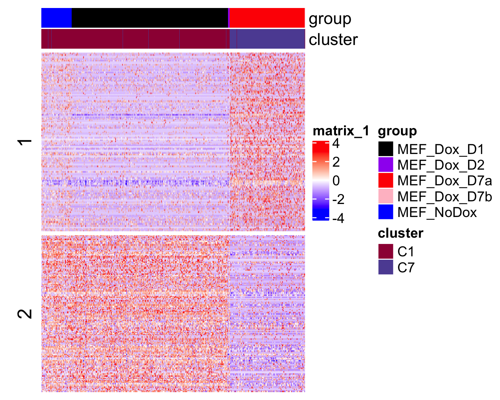
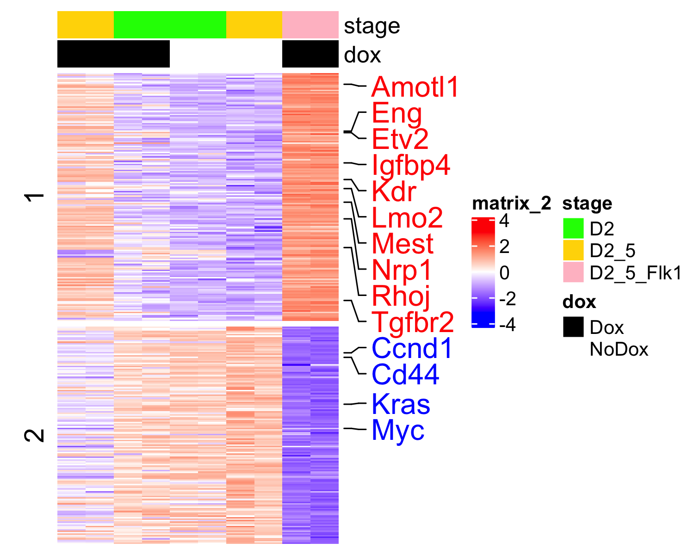
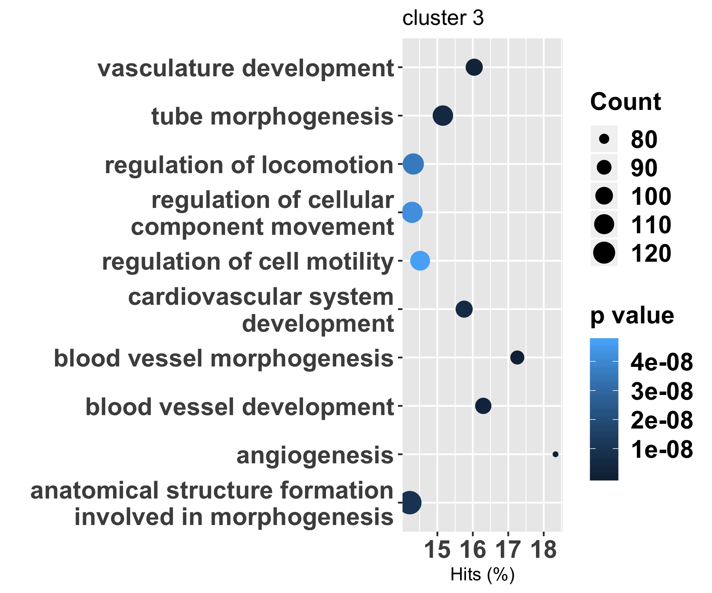
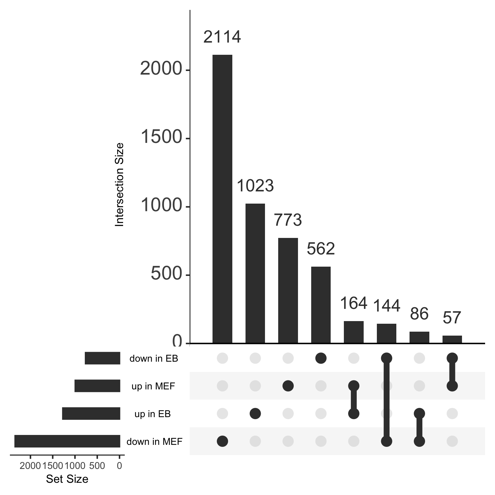

Combined analysis of MEF scRNA-seq and ES/EB bulk RNA-seq
================
12/11/2019

``` r
library(SummarizedExperiment)
library(RColorBrewer)
library(knitr)
library(dplyr)
library(parallel)
library(ggplot2)
library(DESeq2)
library(wordcloud)
library(ComplexHeatmap)
library(circlize)
library(TxDb.Mmusculus.UCSC.mm10.knownGene)
library(goseq)
library(stringr)
library(UpSetR)
```

Read the processed scRNA-seq data and find the DE genes between C1 (MEF)
and C7 (Flk1+ cells at D7 of
reprogramming)

``` r
se <- readRDS(gzcon(url('https://s3.msi.umn.edu/garry_projects/etv2_pioneer/processed_Etv2_scRNAseq.rds')))
n_cluster <- 7
set.seed(1); cls <- kmeans(colData(se)$umap, n_cluster)$cluster
cls <- as.numeric(factor(cls, c(1, 5, 4, 2, 3, 6, 7)))
colData(se)$cluster <- cls
X <- assays(se)$normalized_counts %>% as.matrix()
diff_C7_C1 <- Matrix::rowMeans(X[, cls == 7]) - Matrix::rowMeans(X[, cls == 1])
pvalue_C7_C1 <- unlist(mclapply(1:nrow(X), function(n) tryCatch(wilcox.test(X[n, cls == 7], X[n, cls == 1])$p.value, error = function(e) NA), mc.cores = 4))
```

Load the bulk RNA-seq of Etv2 induction in
ES/EB.

``` r
se_rna <- readRDS(gzcon(url('https://s3.msi.umn.edu/gongx030/datasets/dataset=Etv2RNA-seq_version=20190909a/se.rds')))
se_rna <- DESeqDataSet(se_rna, design = ~ group)
```

    ## Warning in DESeqDataSet(se_rna, design = ~group): some variables in design
    ## formula are characters, converting to factors

``` r
se_rna <- estimateSizeFactors(se_rna)
se_rna <- DESeq(se_rna)
```

    ## using pre-existing size factors

    ## estimating dispersions

    ## gene-wise dispersion estimates

    ## mean-dispersion relationship

    ## final dispersion estimates

    ## fitting model and testing

``` r
assays(se_rna)$normalized_counts <- log2(counts(se_rna, normalized = TRUE) + 1)
res <- results(se_rna, contrast = c('group', 'EB_Dox_D25_Flk1pos_Etv2', 'EB_NoDox_D25_Etv2'))
```

Merge the scRNA-seq and bulk RNA-seq by gene symbols.

``` r
y <- merge(
  data.frame(symbol = rownames(res), EB_log2FoldChange = res$log2FoldChange, EB_pvalue = res$pvalue), 
  data.frame(symbol = rowData(se)$name, MEF_log2FoldChange = diff_C7_C1, MEF_pvalue = pvalue_C7_C1), 
  by.x = 'symbol', 
  by.y = 'symbol'
)
y <- y[!is.na(y$EB_pvalue) & !is.na(y$MEF_pvalue), ]
y <- y[!duplicated(y$symbol), ]
rownames(y) <- y$symbol
```

Look at the genes that are consistently changed in ES/EB and MEF

``` r
n <- y$EB_pvalue < 1e-3
up_MEF <- y$MEF_pvalue < 1e-3 & y$MEF_log2FoldChange > 0 &  y$EB_log2FoldChange > 0
down_MEF <- y$MEF_pvalue < 1e-3 & y$MEF_log2FoldChange < 0 & y$EB_log2FoldChange < 0
bg <- rep('black', nrow(y))
names(bg) <- rownames(y)
bg[up_MEF] <- 'red'
bg[down_MEF] <- 'blue'
lm_model <- lm(MEF_log2FoldChange ~ EB_log2FoldChange - 1, y[n, ])
plot(MEF_log2FoldChange ~ EB_log2FoldChange, y[n, ], cex = 0.1, xlab = 'ES/EB', ylab = 'MEF', pch = 21, bg = bg[n], col = bg[n], main = sprintf('p=%.3e', coef(summary(lm_model))[1, 4]), xpd = TRUE)
abline(v = 0, h = 0, lty = 2)
lm_model <- lm(MEF_log2FoldChange ~ EB_log2FoldChange - 1, y[n, ])
abline(lm_model, lwd = 2, lty = 2, col = 'black')
gs <- c(
  'Etv2', 'Igfbp4', 'Kdr', 'Lmo2',  
  'Ets1', 'Sox18', 'Cdh5', 'Rhoj', 'Vim',
  'Elk3', 'Cd44', 'Tek', 'Gata2', 
  'Eng', 'Itga2b', 'Mest',
  'Egr1', 'Bcat1', 'Myc'
)
wordcloud::textplot(y[gs, 'EB_log2FoldChange'], y[gs, 'MEF_log2FoldChange'], gs, cex = 1.5, new = FALSE,col = bg[gs])
```

<!-- --> A heatmap of combined RNA-seq
data

``` r
# genes up-regulated in both MEF and EB
up_up <- rownames(y)[y$EB_pvalue < 1e-3 & y$EB_log2FoldChange > log2(2) & y$MEF_pvalue < 1e-3 & y$MEF_log2FoldChange > 0.1] 
down_down <- rownames(y)[y$EB_pvalue < 1e-3 & y$EB_log2FoldChange < log2(1/2) & y$MEF_pvalue < 1e-3 & y$MEF_log2FoldChange < -0.1] 
gs <- c(up_up, down_down)
row_vector <- rep(1:2, c(length(up_up), length(down_down)))
# genes to highlight in the heatmap
genes <- c(
  'Etv2', 'Igfbp4', 'Kdr', 'Lmo2',  
  'Ets1', 'Sox18', 'Cdh5', 'Rhoj', 'Vim',
  'Elk3', 'Cd44', 'Tek', 'Gata2', 
  'Eng', 'Itga2b', 'Mest',
  'Egr1', 'Kras',
  'Emcn', 'Nrp1',
  'Prdm1', 'Srf', 'Yy1', 'Yes1', 'Amotl1', 'Tgfbr2', 'Myc', 'Ccnd1', 'Vav3'
)
genes <- genes[genes %in% gs]
col_fun <- colorRamp2(c(-3, 0, 3), c("blue", "white", "red"))
```

``` r
X_sc <- assays(se)$scaled_counts[, cls %in% c(1, 7)] %>% as.matrix()
col_group_sc <- colData(se)$group[cls %in% c(1, 7)]
rownames(X_sc) <- rowData(se)$name
group2bg <- c(
   'MEF_Dox_D1' = 'black',
   'MEF_NoDox' = 'blue',
   'MEF_Dox_D2' = 'purple',
   'MEF_Dox_D7a' = 'red',
   'MEF_Dox_D7b' = 'pink'
 )
cluster2bg <- colorRampPalette(brewer.pal(11,'Spectral'))(n_cluster)
names(cluster2bg) <- sprintf('C%d', 1:n_cluster)
column_annotation <- HeatmapAnnotation(
  group = colData(se)$group[cls %in% c(1, 7)], 
  cluster = sprintf('C%d', colData(se)$cluster[cls %in% c(1, 7)]),
  col = list(group = group2bg, cluster = cluster2bg)
)
Heatmap(X_sc[gs, ], row_split = row_vector, cluster_rows = FALSE, cluster_columns = FALSE, 
        show_row_names = FALSE, 
        col = col_fun, 
        show_row_dend = FALSE,
        top_annotation = column_annotation,
        )
```

<!-- -->

``` r
X_b <- t(scale(t(log2(assays(se_rna)$normalized_counts + 1))))
rownames(X_b) <- rowData(se_rna)$refseq_mrna
group2stage <- c(
  'EB_Dox_D2_Etv2' = 'D2',
  'EB_Dox_D25_Etv2' = 'D2_5',
  'EB_Dox_D25_Flk1pos_Etv2' = 'D2_5_Flk1',
  'EB_NoDox_D2_Etv2' = 'D2',
  'EB_NoDox_D25_Etv2' = 'D2_5'
)
stage <- group2stage[colData(se_rna)$group]
group2dox <- c(
  'EB_Dox_D2_Etv2' = 'Dox',
  'EB_Dox_D25_Etv2' = 'Dox',
  'EB_Dox_D25_Flk1pos_Etv2' = 'Dox',
  'EB_NoDox_D2_Etv2' = 'NoDox',
  'EB_NoDox_D25_Etv2' = 'NoDox'
)
dox <- group2dox[colData(se_rna)$group]
column_annotation <- HeatmapAnnotation(
  stage = stage, 
  dox = dox,
  col = list(stage = c('D2' = 'green', 'D2_5' = 'gold', 'D2_5_Flk1' = 'pink'), dox = c('Dox' = 'black', 'NoDox' = 'white'))
)
mark_col <- rep('red', length(gs))
names(mark_col) <- gs
mark_col[gs %in% down_down] <- 'blue'
mark_at <- which(gs %in% genes)
row_annotation <- rowAnnotation(
  up_genes = anno_mark(
    at = mark_at, 
    labels = gs[mark_at], 
    labels_gp = gpar(fontsize = 15, col = mark_col[mark_at]),
    padding = unit(1, "mm")
  )
)
Heatmap(X_b[gs, ], row_split = row_vector, cluster_rows = FALSE, cluster_columns = TRUE, 
        show_row_names = FALSE, 
        col = col_fun, 
        show_row_dend = FALSE,
        show_column_dend = FALSE,
        top_annotation = column_annotation,
        right_annotation = row_annotation
)
```

<!-- --> Pathway analysis of commonly
up-regulated genes, commonly down-regulated genes and up-regulated in
ES/EB but not in MEF

Create a list of signifiant genes up-regulated in each cluster, fit the
Probability Weighting Function (PWF) and find the significantly enriched
GO
terms.

``` r
up_up <- rownames(y)[y$EB_pvalue < 1e-3 & y$EB_log2FoldChange > log2(2) & y$MEF_pvalue < 1e-3 & y$MEF_log2FoldChange > 0.1] 
down_down <- rownames(y)[y$EB_pvalue < 1e-3 & y$EB_log2FoldChange < log2(1/2) & y$MEF_pvalue < 1e-3 & y$MEF_log2FoldChange < -0.1] 
up_nc <- rownames(y)[y$EB_pvalue < 1e-3 & y$EB_log2FoldChange > log2(2) & !(y$MEF_pvalue < 1e-3 & y$MEF_log2FoldChange > 0.1)]
down_nc <- rownames(y)[y$EB_pvalue < 1e-3 & y$EB_log2FoldChange < log2(1/2) & !(y$MEF_pvalue < 1e-3 & y$MEF_log2FoldChange < -0.1)]

go_res <- lapply(list(up_up, down_down, up_nc, down_nc), function(g){
   x <- rep(0, nrow(y))
   names(x) <- rownames(y)
   x[g] <- 1
   pwf <- nullp(x, "mm10", "geneSymbol", plot.fit = FALSE)
   goseq(pwf, "mm10","geneSymbol", test.cats = c("GO:BP"))
})
```

``` r
h <- 3
  go_res[[h]] %>% 
  filter(numInCat < 1000) %>%
  top_n(10, wt = -over_represented_pvalue) %>% 
  mutate(hitsPerc = numDEInCat * 100 / numInCat, term = str_wrap(term, 30)) %>% 
  ggplot(aes(x = hitsPerc, y = term, colour = over_represented_pvalue, size = numDEInCat)) +
  geom_point() +
  labs(title = sprintf('cluster %d', h), x="Hits (%)", y="", colour="p value", size="Count") +
  theme(axis.text = element_text(size = 15, face = 'bold')) + 
  theme(legend.text = element_text(size = 15, face = 'bold')) + 
  theme(legend.title = element_text(size = 15, face = 'bold'))
```

<!-- --> Make venn diagram showing
the overlap between up- and down- regulated genes between MEF and
ES/EB

``` r
up_in_EB <- rownames(y)[y$EB_pvalue < 1e-3 & y$EB_log2FoldChange > log2(2)]
up_in_MEF <- rownames(y)[y$MEF_pvalue < 1e-3 & y$MEF_log2FoldChange > 0.1] 
down_in_EB <- rownames(y)[y$EB_pvalue < 1e-3 & y$EB_log2FoldChange < -log2(2)] 
down_in_MEF <- rownames(y)[y$MEF_pvalue < 1e-3 & y$MEF_log2FoldChange < -0.1] 
listInput <- list('up in EB' = up_in_EB, 'up in MEF' = up_in_MEF, 'down in EB' = down_in_EB, 'down in MEF' = down_in_MEF)
upset(fromList(listInput), order.by = "freq", point.size = 3.5, line.size = 2, text.scale = c(1, 2, 1, 1, 1, 2))
```

<!-- -->

``` r
sessionInfo()
```

    ## R version 3.6.2 (2019-12-12)
    ## Platform: x86_64-apple-darwin15.6.0 (64-bit)
    ## Running under: macOS Catalina 10.15.2
    ## 
    ## Matrix products: default
    ## BLAS:   /Library/Frameworks/R.framework/Versions/3.6/Resources/lib/libRblas.0.dylib
    ## LAPACK: /Library/Frameworks/R.framework/Versions/3.6/Resources/lib/libRlapack.dylib
    ## 
    ## locale:
    ## [1] en_US.UTF-8/en_US.UTF-8/en_US.UTF-8/C/en_US.UTF-8/en_US.UTF-8
    ## 
    ## attached base packages:
    ##  [1] grid      parallel  stats4    stats     graphics  grDevices utils    
    ##  [8] datasets  methods   base     
    ## 
    ## other attached packages:
    ##  [1] org.Mm.eg.db_3.10.0                      
    ##  [2] UpSetR_1.4.0                             
    ##  [3] stringr_1.4.0                            
    ##  [4] goseq_1.38.0                             
    ##  [5] geneLenDataBase_1.22.0                   
    ##  [6] BiasedUrn_1.07                           
    ##  [7] TxDb.Mmusculus.UCSC.mm10.knownGene_3.10.0
    ##  [8] GenomicFeatures_1.38.0                   
    ##  [9] AnnotationDbi_1.48.0                     
    ## [10] circlize_0.4.8                           
    ## [11] ComplexHeatmap_2.2.0                     
    ## [12] wordcloud_2.6                            
    ## [13] DESeq2_1.26.0                            
    ## [14] ggplot2_3.2.1                            
    ## [15] dplyr_0.8.3                              
    ## [16] knitr_1.26                               
    ## [17] RColorBrewer_1.1-2                       
    ## [18] SummarizedExperiment_1.16.1              
    ## [19] DelayedArray_0.12.1                      
    ## [20] BiocParallel_1.20.1                      
    ## [21] matrixStats_0.55.0                       
    ## [22] Biobase_2.46.0                           
    ## [23] GenomicRanges_1.38.0                     
    ## [24] GenomeInfoDb_1.22.0                      
    ## [25] IRanges_2.20.1                           
    ## [26] S4Vectors_0.24.1                         
    ## [27] BiocGenerics_0.32.0                      
    ## 
    ## loaded via a namespace (and not attached):
    ##  [1] colorspace_1.4-1         rjson_0.2.20             htmlTable_1.13.3        
    ##  [4] XVector_0.26.0           GlobalOptions_0.1.1      base64enc_0.1-3         
    ##  [7] clue_0.3-57              rstudioapi_0.10          farver_2.0.1            
    ## [10] bit64_0.9-7              splines_3.6.2            geneplotter_1.64.0      
    ## [13] zeallot_0.1.0            Formula_1.2-3            Rsamtools_2.2.1         
    ## [16] annotate_1.64.0          GO.db_3.10.0             cluster_2.1.0           
    ## [19] dbplyr_1.4.2             png_0.1-7                compiler_3.6.2          
    ## [22] httr_1.4.1               backports_1.1.5          assertthat_0.2.1        
    ## [25] Matrix_1.2-18            lazyeval_0.2.2           acepack_1.4.1           
    ## [28] htmltools_0.4.0          prettyunits_1.0.2        tools_3.6.2             
    ## [31] gtable_0.3.0             glue_1.3.1               GenomeInfoDbData_1.2.2  
    ## [34] rappdirs_0.3.1           Rcpp_1.0.3               vctrs_0.2.1             
    ## [37] Biostrings_2.54.0        nlme_3.1-143             rtracklayer_1.46.0      
    ## [40] xfun_0.11                lifecycle_0.1.0          XML_3.98-1.20           
    ## [43] zlibbioc_1.32.0          scales_1.1.0             hms_0.5.2               
    ## [46] yaml_2.2.0               curl_4.3                 memoise_1.1.0           
    ## [49] gridExtra_2.3            biomaRt_2.42.0           rpart_4.1-15            
    ## [52] latticeExtra_0.6-29      stringi_1.4.3            RSQLite_2.1.5           
    ## [55] genefilter_1.68.0        checkmate_1.9.4          shape_1.4.4             
    ## [58] rlang_0.4.2              pkgconfig_2.0.3          bitops_1.0-6            
    ## [61] evaluate_0.14            lattice_0.20-38          purrr_0.3.3             
    ## [64] labeling_0.3             GenomicAlignments_1.22.1 htmlwidgets_1.5.1       
    ## [67] bit_1.1-14               tidyselect_0.2.5         plyr_1.8.5              
    ## [70] magrittr_1.5             R6_2.4.1                 Hmisc_4.3-0             
    ## [73] DBI_1.1.0                mgcv_1.8-31              pillar_1.4.3            
    ## [76] foreign_0.8-74           withr_2.1.2              survival_3.1-8          
    ## [79] RCurl_1.95-4.12          nnet_7.3-12              tibble_2.1.3            
    ## [82] crayon_1.3.4             BiocFileCache_1.10.2     rmarkdown_2.0           
    ## [85] jpeg_0.1-8.1             GetoptLong_0.1.7         progress_1.2.2          
    ## [88] locfit_1.5-9.1           data.table_1.12.8        blob_1.2.0              
    ## [91] digest_0.6.23            xtable_1.8-4             openssl_1.4.1           
    ## [94] munsell_0.5.0            askpass_1.1
