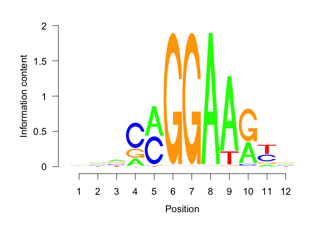
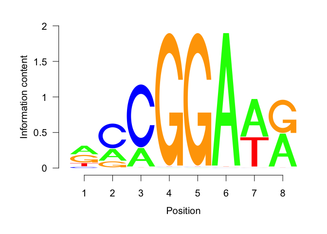
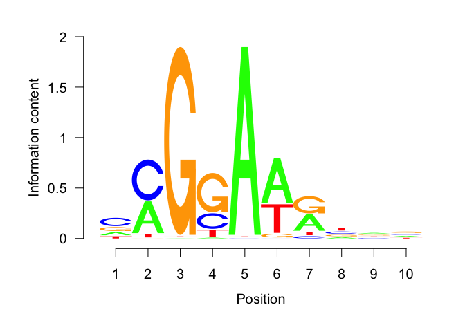
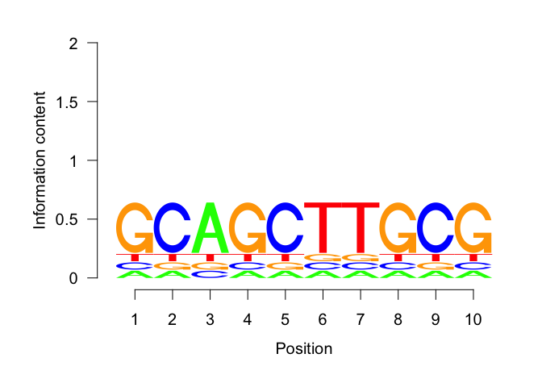
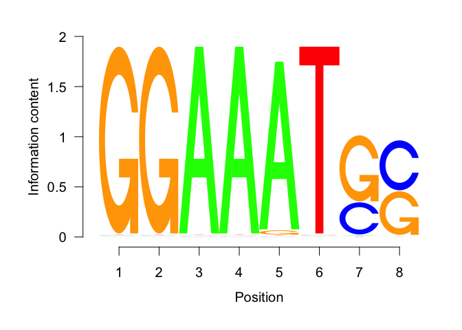
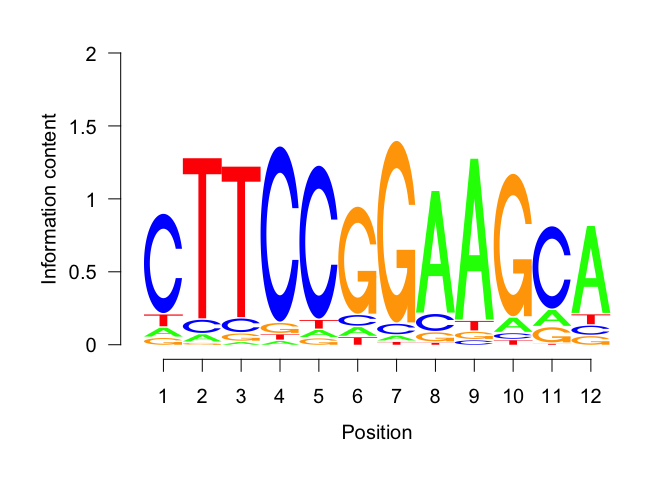
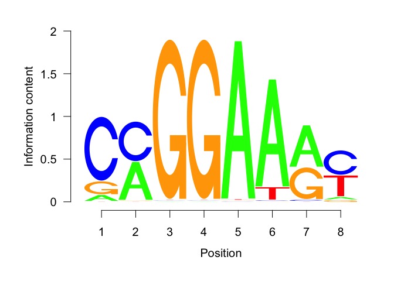
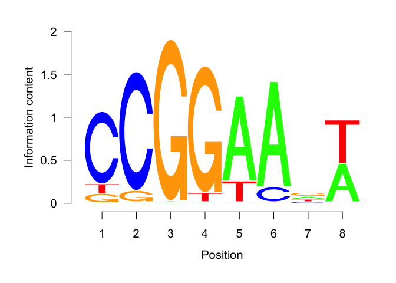
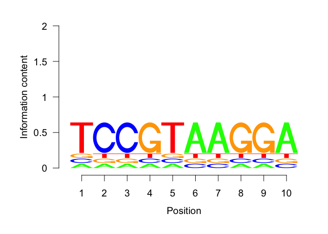

Find motifs differentially enriched between Etv2 peaks at nucleosome and
NFR regions
================
Wuming Gong
1/5/2020

``` r
knitr::opts_chunk$set(fig.path='figures/')
```

# Read de novo motifs identified by Homer (see `find_de_novo_motifs_Etv2_chipseq_peaks.Rmd`)

``` r
homer_output_dir <- 'https://s3.msi.umn.edu/gongx030/projects/etv2_pioneer/Etv2_chipseq_peaks_width=200_homer'
homer_motif_files <- sprintf('%s/%s', homer_output_dir, c('homerMotifs.motifs8', 'homerMotifs.motifs10', 'homerMotifs.motifs12'))
pwm_list <- Reduce('c', lapply(homer_motif_files, function(homer_motif_file) read_homer_motifs(homer_motif_file)))
names(pwm_list) <- sapply(pwm_list, function(z) z@name)
```

# Read the Etv2 motifs in Etv2 ChIP-seq peaks (see `find_de_novo_motifs_Etv2_chipseq_peaks.Rmd`)

``` r
gr <- readRDS(gzcon(url('https://s3.msi.umn.edu/gongx030/projects/etv2_pioneer/Etv2_chipseq_peaks_width=200.rds')))
```

# Use centrimo to find the differentially enriched motifs between NFR and nucleosome centred Etv2 peaks in EB and MEF

## Visualize the motifs that are enriched in each comparison

1.  NFR \> nucleosome in EB
2.  NFR \> nucleosome in MEF
3.  nucleosome \> NFR in EB
4.  nucleosome \> NFR in MEF

<!-- end list -->

``` r
x %>% 
  filter(pos_type == 'NFR' & neg_type == 'nucleosome' & cell == 'EB' & fisher_adj_pvalue < 0.05) %>% 
  select(motif_id, fisher_adj_pvalue, total_sites, neg_sites, cell, pos_type)
```

    ##   motif_id fisher_adj_pvalue total_sites neg_sites cell pos_type
    ## 1 SCATTTCC           6.8e-06        9373      8594   EB      NFR

``` r
pwm_list[['SCATTTCC']] %>% reverseComplement() %>% as.matrix() %>% seqLogo::seqLogo()
```

<!-- -->

``` r
x %>% 
  filter(pos_type == 'NFR' & neg_type == 'nucleosome' & cell == 'MEF' & fisher_adj_pvalue < 0.05) %>% 
  select(motif_id, fisher_adj_pvalue, total_sites, neg_sites, cell, pos_type) %>% 
  arrange(fisher_adj_pvalue)
```

    ##        motif_id fisher_adj_pvalue total_sites neg_sites cell pos_type
    ## 1  NNRCMGGAAGYN           3.3e-34       13038     12120  MEF      NFR
    ## 2      RCCGGAWR           1.2e-32       12715     11490  MEF      NFR
    ## 3    CMGGAARYNV           3.3e-30       13723     13923  MEF      NFR
    ## 4    GCAGCTTGCG           1.8e-05       12418     12981  MEF      NFR
    ## 5    RCCGGAAGTN           2.5e-05       12890     11737  MEF      NFR
    ## 6      SCATTTCC           6.0e-05        5700      4554  MEF      NFR
    ## 7  CTTCCGGAAGCA           9.2e-05        8157      7593  MEF      NFR
    ## 8      CMGGAARY           2.9e-04       12731     11437  MEF      NFR
    ## 9      WYTTCCGG           2.4e-03        8086      6924  MEF      NFR
    ## 10   TCCGTAAGGA           3.0e-03       10528     10400  MEF      NFR
    ## 11     GACGTCAT           5.7e-03        7514      7349  MEF      NFR

``` r
pwm_list[['NNRCMGGAAGYN']] %>% as.matrix() %>% seqLogo::seqLogo()
```

<!-- -->

``` r
pwm_list[['RCCGGAWR']] %>% as.matrix() %>% seqLogo::seqLogo()
```

<!-- -->

``` r
pwm_list[['CMGGAARYNV']] %>% as.matrix() %>% seqLogo::seqLogo()
```

<!-- -->

``` r
pwm_list[['GCAGCTTGCG']] %>% as.matrix() %>% seqLogo::seqLogo()
```

<!-- -->

``` r
pwm_list[['RCCGGAAGTN']] %>% as.matrix() %>% seqLogo::seqLogo()
```

<!-- -->

``` r
pwm_list[['SCATTTCC']] %>% reverseComplement() %>% as.matrix() %>% seqLogo::seqLogo()
```

<!-- -->

``` r
pwm_list[['CTTCCGGAAGCA']] %>% as.matrix() %>% seqLogo::seqLogo()
```

<!-- -->

``` r
pwm_list[['CMGGAARY']] %>% as.matrix() %>% seqLogo::seqLogo()
```

<!-- -->

``` r
pwm_list[['WYTTCCGG']] %>% reverseComplement() %>% as.matrix() %>% seqLogo::seqLogo()
```

<!-- -->

``` r
pwm_list[['TCCGTAAGGA']] %>% as.matrix() %>% seqLogo::seqLogo()
```

<!-- -->

``` r
sessionInfo()
```

    ## R version 3.6.2 (2019-12-12)
    ## Platform: x86_64-apple-darwin15.6.0 (64-bit)
    ## Running under: macOS Catalina 10.15.2
    ## 
    ## Matrix products: default
    ## BLAS:   /Library/Frameworks/R.framework/Versions/3.6/Resources/lib/libRblas.0.dylib
    ## LAPACK: /Library/Frameworks/R.framework/Versions/3.6/Resources/lib/libRlapack.dylib
    ## 
    ## locale:
    ## [1] en_US.UTF-8/en_US.UTF-8/en_US.UTF-8/C/en_US.UTF-8/en_US.UTF-8
    ## 
    ## attached base packages:
    ## [1] stats4    parallel  stats     graphics  grDevices utils     datasets 
    ## [8] methods   base     
    ## 
    ## other attached packages:
    ##  [1] compbio_0.0.0.9000                 dplyr_0.8.3                       
    ##  [3] TFBSTools_1.24.0                   BSgenome.Mmusculus.UCSC.mm10_1.4.0
    ##  [5] BSgenome_1.54.0                    rtracklayer_1.46.0                
    ##  [7] Biostrings_2.54.0                  XVector_0.26.0                    
    ##  [9] GenomicRanges_1.38.0               GenomeInfoDb_1.22.0               
    ## [11] IRanges_2.20.1                     S4Vectors_0.24.1                  
    ## [13] BiocGenerics_0.32.0               
    ## 
    ## loaded via a namespace (and not attached):
    ##   [1] reticulate_1.14             R.utils_2.9.2              
    ##   [3] tidyselect_0.2.5            poweRlaw_0.70.2            
    ##   [5] RSQLite_2.1.5               AnnotationDbi_1.48.0       
    ##   [7] grid_3.6.2                  BiocParallel_1.20.1        
    ##   [9] devtools_2.2.1              munsell_0.5.0              
    ##  [11] withr_2.1.2                 colorspace_1.4-1           
    ##  [13] Biobase_2.46.0              knitr_1.26                 
    ##  [15] rstudioapi_0.10             GenomeInfoDbData_1.2.2     
    ##  [17] bit64_0.9-7                 rprojroot_1.3-2            
    ##  [19] vctrs_0.2.1                 ChIPpeakAnno_3.20.0        
    ##  [21] generics_0.0.2              lambda.r_1.2.4             
    ##  [23] xfun_0.11                   BiocFileCache_1.10.2       
    ##  [25] regioneR_1.18.0             R6_2.4.1                   
    ##  [27] clue_0.3-57                 VGAM_1.1-2                 
    ##  [29] idr_1.2                     locfit_1.5-9.1             
    ##  [31] AnnotationFilter_1.10.0     bitops_1.0-6               
    ##  [33] DelayedArray_0.12.1         assertthat_0.2.1           
    ##  [35] scales_1.1.0                gtable_0.3.0               
    ##  [37] processx_3.4.1              ensembldb_2.10.2           
    ##  [39] seqLogo_1.52.0              rlang_0.4.2                
    ##  [41] zeallot_0.1.0               GlobalOptions_0.1.1        
    ##  [43] splines_3.6.2               lazyeval_0.2.2             
    ##  [45] GEOquery_2.54.1             broom_0.5.3                
    ##  [47] BiocManager_1.30.10         yaml_2.2.0                 
    ##  [49] reshape2_1.4.3              modelr_0.1.5               
    ##  [51] GenomicFeatures_1.38.0      backports_1.1.5            
    ##  [53] RBGL_1.62.1                 EnrichedHeatmap_1.16.0     
    ##  [55] tools_3.6.2                 usethis_1.5.1              
    ##  [57] ggplot2_3.2.1               ellipsis_0.3.0             
    ##  [59] gplots_3.0.1.1              RColorBrewer_1.1-2         
    ##  [61] sessioninfo_1.1.1           Rcpp_1.0.3                 
    ##  [63] plyr_1.8.5                  progress_1.2.2             
    ##  [65] zlibbioc_1.32.0             purrr_0.3.3                
    ##  [67] RCurl_1.95-4.12             ps_1.3.0                   
    ##  [69] prettyunits_1.0.2           openssl_1.4.1              
    ##  [71] GetoptLong_0.1.7            SummarizedExperiment_1.16.1
    ##  [73] haven_2.2.0                 cluster_2.1.0              
    ##  [75] fs_1.3.1                    magrittr_1.5               
    ##  [77] futile.options_1.0.1        circlize_0.4.8             
    ##  [79] reprex_0.3.0                ProtGenerics_1.18.0        
    ##  [81] matrixStats_0.55.0          pkgload_1.0.2              
    ##  [83] hms_0.5.2                   evaluate_0.14              
    ##  [85] xtable_1.8-4                XML_3.98-1.20              
    ##  [87] VennDiagram_1.6.20          readxl_1.3.1               
    ##  [89] shape_1.4.4                 testthat_2.3.1             
    ##  [91] compiler_3.6.2              biomaRt_2.42.0             
    ##  [93] tibble_2.1.3                KernSmooth_2.23-16         
    ##  [95] crayon_1.3.4                R.oo_1.23.0                
    ##  [97] htmltools_0.4.0             tidyr_1.0.0                
    ##  [99] lubridate_1.7.4             DBI_1.1.0                  
    ## [101] formatR_1.7                 dbplyr_1.4.2               
    ## [103] ComplexHeatmap_2.2.0        MASS_7.3-51.5              
    ## [105] rappdirs_0.3.1              ade4_1.7-13                
    ## [107] Matrix_1.2-18               readr_1.3.1                
    ## [109] cli_2.0.0                   R.methodsS3_1.7.1          
    ## [111] gdata_2.18.0                forcats_0.4.0              
    ## [113] pkgconfig_2.0.3             GenomicAlignments_1.22.1   
    ## [115] TFMPvalue_0.0.8             xml2_1.2.2                 
    ## [117] annotate_1.64.0             DirichletMultinomial_1.28.0
    ## [119] multtest_2.42.0             SRAdb_1.48.2               
    ## [121] rvest_0.3.5                 stringr_1.4.0              
    ## [123] callr_3.4.0                 digest_0.6.23              
    ## [125] CNEr_1.22.0                 graph_1.64.0               
    ## [127] rmarkdown_2.0               cellranger_1.1.0           
    ## [129] curl_4.3                    Rsamtools_2.2.1            
    ## [131] gtools_3.8.1                rjson_0.2.20               
    ## [133] lifecycle_0.1.0             nlme_3.1-143               
    ## [135] jsonlite_1.6                seqinr_3.6-1               
    ## [137] futile.logger_1.4.3         desc_1.2.0                 
    ## [139] askpass_1.1                 limma_3.42.0               
    ## [141] fansi_0.4.0                 pillar_1.4.3               
    ## [143] lattice_0.20-38             KEGGREST_1.26.1            
    ## [145] httr_1.4.1                  pkgbuild_1.0.6             
    ## [147] survival_3.1-8              GO.db_3.10.0               
    ## [149] glue_1.3.1                  remotes_2.1.0              
    ## [151] png_0.1-7                   bit_1.1-14                 
    ## [153] stringi_1.4.3               blob_1.2.0                 
    ## [155] caTools_1.17.1.3            memoise_1.1.0              
    ## [157] tidyverse_1.3.0
