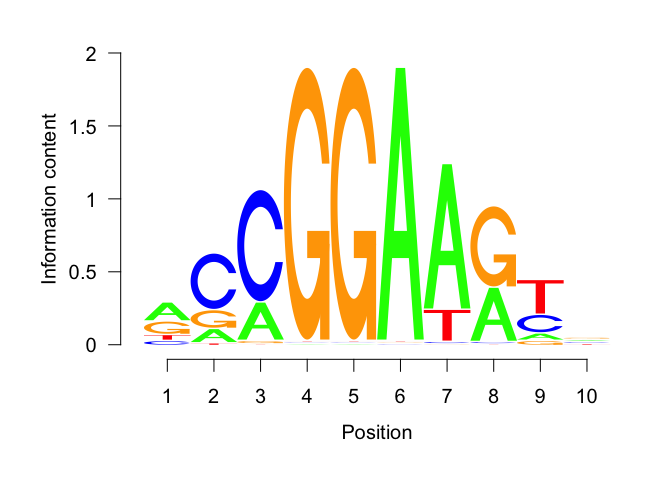

Find motifs differentially enriched between Etv2 peaks at nucleosome and
NFR regions
================
Wuming Gong
1/5/2020

``` r
knitr::opts_chunk$set(fig.path='figures/')
```

# Read de novo motifs identified by Homer (see `find_de_novo_motifs_Etv2_chipseq_peaks.Rmd`)

``` r
homer_output_dir <- 'https://s3.msi.umn.edu/gongx030/projects/etv2_pioneer/Etv2_chipseq_peaks_width=200_homer'
homer_motif_files <- sprintf('%s/%s', homer_output_dir, c('homerMotifs.motifs8', 'homerMotifs.motifs10', 'homerMotifs.motifs12'))
pwm_list <- Reduce('c', lapply(homer_motif_files, function(homer_motif_file) read_homer_motifs(homer_motif_file)))
names(pwm_list) <- sapply(pwm_list, function(z) z@name)
```

# Read the Etv2 motifs in Etv2 ChIP-seq peaks (see `find_de_novo_motifs_Etv2_chipseq_peaks.Rmd`)

``` r
gr <- readRDS(gzcon(url('https://s3.msi.umn.edu/gongx030/projects/etv2_pioneer/Etv2_chipseq_peaks_width=200.rds')))
```

# Use centrimo to find the differentially enriched motifs between NFR and nucleosome centred Etv2 peaks in EB and MEF

SCATTTCC is th only motif that are significantly enriched in NFR in both
MEF and
EB

``` r
x %>% filter(pos_type == 'NFR' & neg_type == 'nucleosome' & fisher_adj_pvalue < 0.05) %>% arrange(fisher_adj_pvalue)
```

    ##    db_index     motif_id motif_alt_id    consensus  E.value adj_p.value
    ## 1         1 NNRCMGGAAGYN           NA NNVCMGGAARYN  0.0e+00     0.0e+00
    ## 2         1     RCCGGAWR           NA     RCCGGAWR  0.0e+00     0.0e+00
    ## 3         1   CMGGAARYNV           NA   CMGGAWRBNN  0.0e+00     0.0e+00
    ## 4         1     SCATTTCC           NA     SCATTTCC 7.0e-202    9.3e-204
    ## 5         1   GCAGCTTGCG           NA   GCAGCTTGCG  1.3e-09     1.7e-11
    ## 6         1   RCCGGAAGTN           NA   RCCGGAARYN  0.0e+00     0.0e+00
    ## 7         1     SCATTTCC           NA     SCATTTCC  0.0e+00     0.0e+00
    ## 8         1 CTTCCGGAAGCA           NA CTTCCGGAAGCA 1.5e-162    2.0e-164
    ## 9         1     CMGGAARY           NA     CMGGAARY  0.0e+00     0.0e+00
    ## 10        1     WYTTCCGG           NA     WHTTCCGG  0.0e+00     0.0e+00
    ## 11        1   TCCGTAAGGA           NA   TCCGTAAGGA 6.4e-115    8.5e-117
    ## 12        1     GACGTCAT           NA     GACGTCAT  5.4e-02     7.2e-04
    ##    log_adj_p.value bin_location bin_width total_width sites_in_bin total_sites
    ## 1         -2001.79            0        75         189         8754       13038
    ## 2         -1989.02            0        73         193         8328       12715
    ## 3         -1554.21            0        61         191         7555       13723
    ## 4          -467.49            0        67         193         4699        9373
    ## 5           -24.80            0        49         191         3544       12418
    ## 6         -2747.32            0         1         191         1324       12890
    ## 7          -837.84            0        65         193         3435        5700
    ## 8          -376.93            0         7         189          874        8157
    ## 9         -2556.16            0         1         193         1252       12731
    ## 10        -1091.24            0         1         193          612        8086
    ## 11         -267.26            0         1         191          301       10528
    ## 12           -7.24            0       129         193         5198        7514
    ##    p_success  p.value mult_tests neg_sites_in_bin neg_sites neg_adj_pvalue
    ## 1    0.39683  0.0e+00         94             7216     12120        0.0e+00
    ## 2    0.37824  0.0e+00         96             6647     11490        0.0e+00
    ## 3    0.31937  0.0e+00         95             6681     13923        0.0e+00
    ## 4    0.34715 9.7e-206         96             3970      8594       1.4e-104
    ## 5    0.25654  1.8e-13         95             3336     12981        1.0e+00
    ## 6    0.00524  0.0e+00         95              986     11737        0.0e+00
    ## 7    0.33679  0.0e+00         96             2527      4554       3.2e-197
    ## 8    0.03704 2.1e-166         94              643      7593        5.5e-78
    ## 9    0.00518  0.0e+00         96              933     11437        0.0e+00
    ## 10   0.00518  0.0e+00         96              408      6924       1.6e-274
    ## 11   0.00524 9.0e-119         95              208     10400        4.7e-55
    ## 12   0.66839  7.5e-06         96             4866      7349        1.0e+00
    ##    log_neg_adj_pvalue fisher_adj_pvalue log_fisher_adj_pvalue cell pos_type
    ## 1             -969.05           3.3e-34                -77.10  MEF      NFR
    ## 2             -941.37           1.2e-32                -73.51  MEF      NFR
    ## 3             -772.40           3.3e-30                -67.87  MEF      NFR
    ## 4             -239.15           6.8e-06                -11.90   EB      NFR
    ## 5                0.00           1.8e-05                -10.91  MEF      NFR
    ## 6            -1849.02           2.5e-05                -10.60  MEF      NFR
    ## 7             -452.43           6.0e-05                 -9.72  MEF      NFR
    ## 8             -177.89           9.2e-05                 -9.30  MEF      NFR
    ## 9            -1732.76           2.9e-04                 -8.14  MEF      NFR
    ## 10            -630.41           2.4e-03                 -6.01  MEF      NFR
    ## 11            -125.10           3.0e-03                 -5.81  MEF      NFR
    ## 12               0.00           5.7e-03                 -5.16  MEF      NFR
    ##      neg_type
    ## 1  nucleosome
    ## 2  nucleosome
    ## 3  nucleosome
    ## 4  nucleosome
    ## 5  nucleosome
    ## 6  nucleosome
    ## 7  nucleosome
    ## 8  nucleosome
    ## 9  nucleosome
    ## 10 nucleosome
    ## 11 nucleosome
    ## 12 nucleosome

``` r
x %>% filter(motif_id == 'SCATTTCC' & pos_type == 'NFR') %>% select(E.value, total_sites, neg_sites, fisher_adj_pvalue, cell, pos_type, neg_type)
```

    ##   E.value total_sites neg_sites fisher_adj_pvalue cell pos_type   neg_type
    ## 1  7e-202        9373      8594           6.8e-06   EB      NFR nucleosome
    ## 2   0e+00        5700      4554           6.0e-05  MEF      NFR nucleosome

``` r
pwm_list[['SCATTTCC']] %>% reverseComplement() %>% as.matrix() %>% seqLogo::seqLogo()
```

<!-- --> Plot the canonitcal Etv2
motifs that are most enriched in
    EB

``` r
x %>% arrange(log_adj_p.value)
```

    ##     db_index     motif_id motif_alt_id    consensus       E.value   adj_p.value
    ## 1          1   RCCGGAAGTN           NA   RCCGGAARYN  0.000000e+00  0.000000e+00
    ## 2          1     CMGGAARY           NA     CMGGAARY  0.000000e+00  0.000000e+00
    ## 3          1     CYTTCCYC           NA     SYTTCCYS  0.000000e+00  0.000000e+00
    ## 4          1   RCCGGAAGTN           NA   RCCGGAARYN  0.000000e+00  0.000000e+00
    ## 5          1   RCCGGAAGTN           NA   RCCGGAARYN  0.000000e+00  0.000000e+00
    ## 6          1     CYTTCCYC           NA     SYTTCCYS  0.000000e+00  0.000000e+00
    ## 7          1     CMGGAARY           NA     CMGGAARY  0.000000e+00  0.000000e+00
    ## 8          1     CMGGAARY           NA     CMGGAARY  0.000000e+00  0.000000e+00
    ## 9          1 NNRCMGGAAGYN           NA NNVCMGGAARYN  0.000000e+00  0.000000e+00
    ## 10         1     RCCGGAWR           NA     RCCGGAWR  0.000000e+00  0.000000e+00
    ## 11         1   RCCGGAAGTN           NA   RCCGGAARYN  0.000000e+00  0.000000e+00
    ## 12         1     CMGGAARY           NA     CMGGAARY  0.000000e+00  0.000000e+00
    ## 13         1     WYTTCCGG           NA     WHTTCCGG  0.000000e+00  0.000000e+00
    ## 14         1     MAGGAART           NA     MAGGAWRT  0.000000e+00  0.000000e+00
    ## 15         1     MAGGAART           NA     MAGGAWRT  0.000000e+00  0.000000e+00
    ## 16         1   CMGGAARYNV           NA   CMGGAWRBNN  0.000000e+00  0.000000e+00
    ## 17         1   CMGGAARYNV           NA   CMGGAWRBNN  0.000000e+00  0.000000e+00
    ## 18         1     CYTTCCYC           NA     SYTTCCYS  0.000000e+00  0.000000e+00
    ## 19         1   CMGGAARYNV           NA   CMGGAWRBNN  0.000000e+00  0.000000e+00
    ## 20         1     KCWTCCTG           NA     KCWKCCTG  0.000000e+00  0.000000e+00
    ## 21         1 NNRCMGGAAGYN           NA NNVCMGGAARYN  0.000000e+00  0.000000e+00
    ## 22         1     CYTTCCYC           NA     SYTTCCYS  0.000000e+00  0.000000e+00
    ## 23         1     MAGGAART           NA     MAGGAWRT  0.000000e+00  0.000000e+00
    ## 24         1     RCCGGAWR           NA     RCCGGAWR  0.000000e+00  0.000000e+00
    ## 25         1 NNRCMGGAAGYN           NA NNVCMGGAARYN  0.000000e+00  0.000000e+00
    ## 26         1     WYTTCCGG           NA     WHTTCCGG  0.000000e+00  0.000000e+00
    ## 27         1     RCCGGAWR           NA     RCCGGAWR  0.000000e+00  0.000000e+00
    ## 28         1   ACWGGRAGGA           NA   ASWGGRAGGA  0.000000e+00  0.000000e+00
    ## 29         1 NNRCMGGAAGYN           NA NNVCMGGAARYN  0.000000e+00  0.000000e+00
    ## 30         1     KCWTCCTG           NA     KCWKCCTG  0.000000e+00  0.000000e+00
    ## 31         1     MAGGAART           NA     MAGGAWRT  0.000000e+00  0.000000e+00
    ## 32         1     RCCGGAWR           NA     RCCGGAWR  0.000000e+00  0.000000e+00
    ## 33         1     GCGCATGC           NA     GCGCATGC  0.000000e+00  0.000000e+00
    ## 34         1     WYTTCCGG           NA     WHTTCCGG  0.000000e+00  0.000000e+00
    ## 35         1     GCTTCCTC           NA     GCTTCCTC  0.000000e+00  0.000000e+00
    ## 36         1 RRCAGGATGTSS           NA VRCAGGATRYVS  0.000000e+00  0.000000e+00
    ## 37         1   ACWGGRAGGA           NA   ASWGGRAGGA  0.000000e+00  0.000000e+00
    ## 38         1 VCAGGAAGGAAG           NA NCAGGMAGGARR  0.000000e+00  0.000000e+00
    ## 39         1   CMGGAARYNV           NA   CMGGAWRBNN  0.000000e+00  0.000000e+00
    ## 40         1     SCATTTCC           NA     SCATTTCC  0.000000e+00  0.000000e+00
    ## 41         1     GCTTCCTC           NA     GCTTCCTC 1.499983e-320 1.976263e-322
    ## 42         1     GCGCATGC           NA     GCGCATGC 1.199987e-319 1.600773e-321
    ## 43         1 RRCAGGATGTSS           NA VRCAGGATRYVS 2.900000e-306 3.800000e-308
    ## 44         1 RRCAGGATGTSS           NA VRCAGGATRYVS 6.800000e-282 9.100000e-284
    ## 45         1     WYTTCCGG           NA     WHTTCCGG 1.200000e-272 1.600000e-274
    ## 46         1 RRCAGGATGTSS           NA VRCAGGATRYVS 3.100000e-258 4.200000e-260
    ## 47         1     SCGGAACY           NA     SCGGAACB 6.600000e-248 8.800000e-250
    ## 48         1     GCTTCCTC           NA     GCTTCCTC 2.300000e-239 3.100000e-241
    ## 49         1   ACAGGAAAAC           NA   WCAGGAAAAC 3.800000e-229 5.100000e-231
    ## 50         1     GCTTCCTC           NA     GCTTCCTC 1.500000e-217 2.000000e-219
    ## 51         1     AGYTTCCT           NA     AGYTTCCT 1.600000e-207 2.100000e-209
    ## 52         1     SCATTTCC           NA     SCATTTCC 7.000000e-202 9.300000e-204
    ## 53         1   CCHCMCCCMC           NA   CCHCMYCCHC 1.300000e-201 1.800000e-203
    ## 54         1     SCATTTCC           NA     SCATTTCC 1.300000e-199 1.700000e-201
    ## 55         1 VCAGGAAGGAAG           NA NCAGGMAGGARR 5.900000e-191 7.900000e-193
    ## 56         1   CCHCMCCCMC           NA   CCHCMYCCHC 5.600000e-183 7.500000e-185
    ## 57         1 CCGGGATCAAGA           NA CCGGGATCAAGA 2.000000e-179 2.700000e-181
    ## 58         1 CTTCCGGAAGCA           NA CTTCCGGAAGCA 7.500000e-177 1.000000e-178
    ## 59         1   TCCGTAAGGA           NA   TCCGTAAGGA 6.300000e-171 8.400000e-173
    ## 60         1     KCWTCCTG           NA     KCWKCCTG 1.500000e-162 2.000000e-164
    ## 61         1 CTTCCGGAAGCA           NA CTTCCGGAAGCA 1.500000e-162 2.000000e-164
    ## 62         1 CCGGGATCAAGA           NA CCGGGATCAAGA 2.700000e-161 3.600000e-163
    ## 63         1   ACAGGAAAAC           NA   WCAGGAAAAC 2.100000e-156 2.800000e-158
    ## 64         1     AGGAACTG           NA     AGGAACTG 2.900000e-150 3.900000e-152
    ## 65         1   ACWGGRAGGA           NA   ASWGGRAGGA 3.500000e-148 4.600000e-150
    ## 66         1   ACWGGRAGGA           NA   ASWGGRAGGA 9.900000e-147 1.300000e-148
    ## 67         1     KCWTCCTG           NA     KCWKCCTG 3.100000e-136 4.200000e-138
    ## 68         1   CTCGGACGTT           NA   CTCGGACGTT 7.100000e-136 9.500000e-138
    ## 69         1     GCGCATGC           NA     GCGCATGC 1.600000e-131 2.100000e-133
    ## 70         1     AGYTTCCT           NA     AGYTTCCT 1.500000e-127 2.000000e-129
    ## 71         1   ACAGGAAAAC           NA   WCAGGAAAAC 1.700000e-124 2.300000e-126
    ## 72         1   TCCGTAAGGA           NA   TCCGTAAGGA 5.200000e-123 7.000000e-125
    ## 73         1   ACAGGAAAAC           NA   WCAGGAAAAC 5.400000e-121 7.300000e-123
    ## 74         1 VCAGGAAGGAAG           NA NCAGGMAGGARR 3.400000e-120 4.600000e-122
    ## 75         1     GCGCATGC           NA     GCGCATGC 2.000000e-118 2.700000e-120
    ## 76         1     AGGAACTG           NA     AGGAACTG 3.400000e-115 4.500000e-117
    ## 77         1   TCCGTAAGGA           NA   TCCGTAAGGA 6.400000e-115 8.500000e-117
    ## 78         1     SCATTTCC           NA     SCATTTCC 2.600000e-114 3.500000e-116
    ## 79         1 CTTCCGGAAGCA           NA CTTCCGGAAGCA 4.600000e-113 6.100000e-115
    ## 80         1   CTCGGACGTT           NA   CTCGGACGTT 3.900000e-110 5.200000e-112
    ## 81         1 VCAGGAAGGAAG           NA NCAGGMAGGARR 1.100000e-105 1.500000e-107
    ## 82         1     SCGGAACY           NA     SCGGAACB 1.400000e-103 1.900000e-105
    ## 83         1     SCGGAACY           NA     SCGGAACB 1.400000e-102 1.800000e-104
    ## 84         1     AGYTTCCT           NA     AGYTTCCT  1.100000e-99 1.400000e-101
    ## 85         1     AGYTTCCT           NA     AGYTTCCT  1.700000e-98 2.300000e-100
    ## 86         1     AGGAACTG           NA     AGGAACTG  7.200000e-79  9.700000e-81
    ## 87         1 CTTCCGGAAGCA           NA CTTCCGGAAGCA  2.500000e-75  3.300000e-77
    ## 88         1     AGTAAACA           NA     WGTAAAYA  1.300000e-73  1.800000e-75
    ## 89         1   CAGKAAATTR           NA   CRGKAAATWR  2.600000e-73  3.500000e-75
    ## 90         1     AGGAACTG           NA     AGGAACTG  1.200000e-72  1.700000e-74
    ## 91         1   CTCGGACGTT           NA   CTCGGACGTT  1.400000e-67  1.800000e-69
    ## 92         1   CAGKAAATTR           NA   CRGKAAATWR  7.300000e-66  9.800000e-68
    ## 93         1   CCHCMCCCMC           NA   CCHCMYCCHC  9.600000e-66  1.300000e-67
    ## 94         1 CCGGGATCAAGA           NA CCGGGATCAAGA  1.200000e-65  1.600000e-67
    ## 95         1 CCGGGATCAAGA           NA CCGGGATCAAGA  1.300000e-64  1.700000e-66
    ## 96         1     SGAATGCK           NA     SGAATSCD  2.000000e-59  2.600000e-61
    ## 97         1     SCGGAACY           NA     SCGGAACB  7.800000e-59  1.000000e-60
    ## 98         1   CAGKAAATTR           NA   CRGKAAATWR  2.000000e-58  2.700000e-60
    ## 99         1 TTCTGTTTCCGT           NA TTSTGTYTCCGT  1.800000e-54  2.300000e-56
    ## 100        1   TCCGTAAGGA           NA   TCCGTAAGGA  1.000000e-52  1.400000e-54
    ## 101        1   CAGKAAATTR           NA   CRGKAAATWR  1.400000e-50  1.900000e-52
    ## 102        1   CCHCMCCCMC           NA   CCHCMYCCHC  3.500000e-50  4.700000e-52
    ## 103        1   TCTAGCCGTC           NA   TCTAGCCGTC  4.200000e-50  5.600000e-52
    ## 104        1 GGGTGGGGTAGG           NA GGGTGGGGTAGG  2.600000e-47  3.400000e-49
    ## 105        1     AGTAAACA           NA     WGTAAAYA  1.400000e-43  1.900000e-45
    ## 106        1 GCAGTGGGATGA           NA RCASTGGGAKGA  7.400000e-43  9.900000e-45
    ## 107        1   TCTAGCCGTC           NA   TCTAGCCGTC  7.800000e-43  1.000000e-44
    ## 108        1 TTCTGTTTCCGT           NA TTSTGTYTCCGT  3.500000e-42  4.700000e-44
    ## 109        1   CTCGGACGTT           NA   CTCGGACGTT  1.900000e-40  2.500000e-42
    ## 110        1 GGGTGGGGTAGG           NA GGGTGGGGTAGG  4.300000e-37  5.700000e-39
    ## 111        1 TTCTGTTTCCGT           NA TTSTGTYTCCGT  7.300000e-33  9.800000e-35
    ## 112        1     AGTAAACA           NA     WGTAAAYA  1.100000e-31  1.500000e-33
    ## 113        1   GTGTTACACC           NA   GTGTTACACC  5.000000e-29  6.700000e-31
    ## 114        1 TTCTGTTTCCGT           NA TTSTGTYTCCGT  4.300000e-26  5.700000e-28
    ## 115        1   GGGGGATGAC           NA   GGGGGATGAC  1.300000e-24  1.800000e-26
    ## 116        1 GYAGCTTGCGCW           NA GYAGCTTGCGCW  1.400000e-24  1.900000e-26
    ## 117        1     SGAATGCK           NA     SGAATSCD  1.500000e-23  2.000000e-25
    ## 118        1     AGTAAACA           NA     WGTAAAYA  5.400000e-23  7.100000e-25
    ## 119        1   TCCTGCTGAT           NA   TCCTGCTGAT  2.600000e-20  3.400000e-22
    ## 120        1   GTGTTACACC           NA   GTGTTACACC  4.700000e-19  6.300000e-21
    ## 121        1     GCCAGCAT           NA     GCCAGCAT  2.600000e-18  3.500000e-20
    ## 122        1 GYAGCTTGCGCW           NA GYAGCTTGCGCW  4.400000e-17  5.900000e-19
    ## 123        1   TCTAGCCGTC           NA   TCTAGCCGTC  1.300000e-15  1.700000e-17
    ## 124        1 GCAGTGGGATGA           NA RCASTGGGAKGA  1.300000e-15  1.700000e-17
    ## 125        1   TCCCCTGGGA           NA   YCCCCWGGGR  1.600000e-15  2.200000e-17
    ## 126        1   GGGGGATGAC           NA   GGGGGATGAC  1.900000e-15  2.600000e-17
    ## 127        1 GGGTGGGGTAGG           NA GGGTGGGGTAGG  2.400000e-15  3.100000e-17
    ## 128        1     GGGGGATG           NA     GGGGGATG  2.500000e-15  3.400000e-17
    ## 129        1   TCTAGCCGTC           NA   TCTAGCCGTC  4.400000e-14  5.800000e-16
    ## 130        1 GYAGCTTGCGCW           NA GYAGCTTGCGCW  1.700000e-12  2.300000e-14
    ## 131        1     GGGTGGGG           NA     GGGTGGGG  2.800000e-12  3.800000e-14
    ## 132        1     CACATTCC           NA     CACATTCC  3.200000e-10  4.300000e-12
    ## 133        1     GGGTGGGG           NA     GGGTGGGG  7.600000e-10  1.000000e-11
    ## 134        1   GCAGCTTGCG           NA   GCAGCTTGCG  1.300000e-09  1.700000e-11
    ## 135        1     GGGGGATG           NA     GGGGGATG  1.300000e-09  1.700000e-11
    ## 136        1     KGCGCATG           NA     KGCGCATG  1.800000e-09  2.500000e-11
    ## 137        1 TGATTTTCTGAG           NA TGATTTTCTGAG  6.700000e-09  9.000000e-11
    ## 138        1     SGAATGCK           NA     SGAATSCD  2.700000e-08  3.700000e-10
    ## 139        1   TCCTGCTGAT           NA   TCCTGCTGAT  1.200000e-07  1.600000e-09
    ## 140        1 GGGTGGGGTAGG           NA GGGTGGGGTAGG  2.400000e-07  3.200000e-09
    ## 141        1     CACATTCC           NA     CACATTCC  2.500000e-07  3.300000e-09
    ## 142        1     SGAATGCK           NA     SGAATSCD  7.400000e-07  9.800000e-09
    ## 143        1 GYAGCTTGCGCW           NA GYAGCTTGCGCW  1.200000e-06  1.600000e-08
    ## 144        1   GGGGGATGAC           NA   GGGGGATGAC  8.100000e-06  1.100000e-07
    ## 145        1     GGGGGATG           NA     GGGGGATG  1.300000e-05  1.700000e-07
    ## 146        1   GCAGCTTGCG           NA   GCAGCTTGCG  2.700000e-05  3.600000e-07
    ## 147        1   GTGTTACACC           NA   GTGTTACACC  3.200000e-05  4.300000e-07
    ## 148        1 GCAGTGGGATGA           NA RCASTGGGAKGA  4.900000e-05  6.500000e-07
    ## 149        1 TGATTTTCTGAG           NA TGATTTTCTGAG  5.800000e-05  7.700000e-07
    ## 150        1   GGGGGATGAC           NA   GGGGGATGAC  1.000000e-04  1.400000e-06
    ## 151        1   GTGTTACACC           NA   GTGTTACACC  1.300000e-04  1.700000e-06
    ## 152        1   GCAGCTTGCG           NA   GCAGCTTGCG  1.500000e-04  2.000000e-06
    ## 153        1   TCCCCTGGGA           NA   YCCCCWGGGR  1.800000e-04  2.400000e-06
    ## 154        1   GATTTTCTGA           NA   GATTTTCTGA  2.800000e-04  3.700000e-06
    ## 155        1 CTCCTGCTGATG           NA CTCCTGCTGATG  5.400000e-04  7.200000e-06
    ## 156        1     GGGTGGGG           NA     GGGTGGGG  7.500000e-04  1.000000e-05
    ## 157        1 TGATTTTCTGAG           NA TGATTTTCTGAG  1.600000e-03  2.100000e-05
    ## 158        1 TCTAGCCGGCYT           NA TCTAGCCGKCYT  1.900000e-03  2.500000e-05
    ## 159        1 CTCCTGCTGATG           NA CTCCTGCTGATG  6.900000e-03  9.200000e-05
    ## 160        1     GGGTGGGG           NA     GGGTGGGG  7.000000e-03  9.300000e-05
    ## 161        1     CACATTCC           NA     CACATTCC  9.500000e-03  1.300000e-04
    ## 162        1 TCCACCTGTGCT           NA TCCACCTGTGCT  1.600000e-02  2.100000e-04
    ## 163        1   TCCTGCTGAT           NA   TCCTGCTGAT  1.700000e-02  2.300000e-04
    ## 164        1     CCCTGGGG           NA     CCCTGGGG  3.000000e-02  4.000000e-04
    ## 165        1 RCRCGCRYGCRC           NA RCRYGCRYRCRY  3.300000e-02  4.400000e-04
    ## 166        1     CCCTGGGG           NA     CCCTGGGG  3.500000e-02  4.700000e-04
    ## 167        1 GCAGTGGGATGA           NA RCASTGGGAKGA  4.400000e-02  5.800000e-04
    ## 168        1     GACGTCAT           NA     GACGTCAT  5.400000e-02  7.200000e-04
    ## 169        1 CCTTTTTTGTCC           NA CCTTTTTTGTCC  1.200000e-01  1.600000e-03
    ## 170        1   CGGACAAAAA           NA   CGGACAAAAA  1.400000e-01  1.900000e-03
    ## 171        1   GATTTTCTGA           NA   GATTTTCTGA  1.800000e-01  2.300000e-03
    ## 172        1 GAWTTTCTGAAG           NA GAWTTTCTGARG  2.000000e-01  2.700000e-03
    ## 173        1   CRCGCGCGCG           NA   CRCGCGYGCR  4.600000e-01  6.100000e-03
    ## 174        1 CTCCTGCTGATG           NA CTCCTGCTGATG  6.100000e-01  8.200000e-03
    ## 175        1 ATGCTCCTGACT           NA ATGCTCCTGACT  6.200000e-01  8.300000e-03
    ## 176        1     CACATTCC           NA     CACATTCC  6.500000e-01  8.600000e-03
    ## 177        1     KGCGCATG           NA     KGCGCATG  7.700000e-01  1.000000e-02
    ## 178        1     GGGGGATG           NA     GGGGGATG  8.400000e-01  1.100000e-02
    ## 179        1 TGATTTTCTGAG           NA TGATTTTCTGAG  8.900000e-01  1.200000e-02
    ## 180        1   GCAGCTTGCG           NA   GCAGCTTGCG  1.000000e+00  1.400000e-02
    ## 181        1 GAWTTTCTGAAG           NA GAWTTTCTGARG  1.800000e+00  2.400000e-02
    ## 182        1     CGCGCGCG           NA     CRCGCGCG  3.000000e+00  4.000000e-02
    ## 183        1   CTGGACGGTT           NA   CTGGACGGTT  4.600000e+00  6.100000e-02
    ## 184        1 CTCCTGCTGATG           NA CTCCTGCTGATG  7.900000e+00  1.100000e-01
    ##     log_adj_p.value bin_location bin_width total_width sites_in_bin total_sites
    ## 1          -3235.58            0         1         191         2028       32273
    ## 2          -3007.51            0         1         193         1895       30744
    ## 3          -2788.72            0         1         193         1979       38805
    ## 4          -2747.32            0         1         191         1324       12890
    ## 5          -2739.18            0         1         191         1715       27239
    ## 6          -2622.29            0         1         193         1988       43005
    ## 7          -2556.16            0         1         193         1252       12731
    ## 8          -2518.42            0         1         193         1601       26331
    ## 9          -2001.79            0        75         189         8754       13038
    ## 10         -1989.02            0        73         193         8328       12715
    ## 11         -1844.35            0         1         191          983       11707
    ## 12         -1731.70            0         1         193          934       11468
    ## 13         -1646.72            0         1         193         1089       19137
    ## 14         -1630.62            0         1         193          994       15218
    ## 15         -1579.38            0         1         193          777        7971
    ## 16         -1554.21            0        61         191         7555       13723
    ## 17         -1424.02            0         3         191         2341       39555
    ## 18         -1402.28            0         1         193          880       14164
    ## 19         -1381.14            0         3         191         2211       36576
    ## 20         -1305.64            0         1         193         1108       28027
    ## 21         -1283.83            0         3         189         2066       33971
    ## 22         -1273.64            0         1         193          841       14721
    ## 23         -1247.07            0         1         193          765       11870
    ## 24         -1185.95            0         3         193         1889       31429
    ## 25         -1120.22            0         3         189         1801       29595
    ## 26         -1091.24            0         1         193          612        8086
    ## 27         -1084.96            0         3         193         1676       27188
    ## 28         -1084.58            0         1         191         1016       28839
    ## 29          -966.62            0        67         189         6678       12127
    ## 30          -965.80            0         1         193          935       27887
    ## 31          -951.79            0         1         193          507        6073
    ## 32          -937.99            0        75         193         6767       11490
    ## 33          -934.71            0         1         193          874       24977
    ## 34          -917.90            0         1         193          646       12513
    ## 35          -888.38            0         1         193          599       10827
    ## 36          -883.13            0         1         189          538        8050
    ## 37          -862.00            0         1         191          914       30031
    ## 38          -840.84            0         7         189         3193       38677
    ## 39          -838.50            0         3         191         1049       13939
    ## 40          -837.84            0        65         193         3435        5700
    ## 41          -740.74            0         1         193          569       12524
    ## 42          -738.65            0         1         193          721       21757
    ## 43          -707.85            0         1         189          421        6034
    ## 44          -651.72            0         1         189          327        3409
    ## 45          -630.41            0         1         193          408        6924
    ## 46          -597.24            0         1         189          308        3403
    ## 47          -573.47            0         1         193          513       13854
    ## 48          -553.78            0         1         193          346        5525
    ## 49          -530.28            0         1         191          353        6177
    ## 50          -503.57            0         1         193          319        5207
    ## 51          -480.50            0         3         193          771       12904
    ## 52          -467.49            0        67         193         4699        9373
    ## 53          -466.85            0         5         191         1680       27891
    ## 54          -462.27            0        69         193         2639        4554
    ## 55          -442.34            0         7         189         2853       42346
    ## 56          -423.96            0         5         191         1740       30649
    ## 57          -415.77            0         5         189         1094       15269
    ## 58          -409.86            0         7         189         1690       21222
    ## 59          -396.22            0         1         191          637       31151
    ## 60          -376.93            0         1         193          343        9486
    ## 61          -376.93            0         7         189          874        8157
    ## 62          -374.05            0         5         189         1160       17708
    ## 63          -362.80            0         1         191          286        6432
    ## 64          -348.64            0         3         193          652       12252
    ## 65          -343.86            0         1         191          335        9950
    ## 66          -340.51            0         1         191          340       10395
    ## 67          -316.33            0         1         193          299        8655
    ## 68          -315.50            0         1         191          573       30875
    ## 69          -305.52            0         1         193          289        8327
    ## 70          -296.33            0         3         193          625       12776
    ## 71          -289.29            0         1         191          167        2287
    ## 72          -285.88            0         1         191          498       25988
    ## 73          -281.23            0         1         191          166        2345
    ## 74          -279.40            0         7         189         1104       13600
    ## 75          -275.33            0         1         193          284        9063
    ## 76          -267.90            0         3         193          536       10554
    ## 77          -267.26            0         1         191          301       10528
    ## 78          -265.84            0         5         193          638        8594
    ## 79          -262.98            0         7         189         1360       18669
    ## 80          -256.24            0         1         191          445       23195
    ## 81          -245.99            0         7         189         1104       14349
    ## 82          -241.12            0         1         193          207        5254
    ## 83          -238.87            0         1         193          262        8981
    ## 84          -232.22            0         3         193          311        4437
    ## 85          -229.42            0         3         193          308        4410
    ## 86          -184.24            0         3         193          279        4425
    ## 87          -176.11            0         7         189          646        7689
    ## 88          -172.13            0         3         193          634       17748
    ## 89          -171.45            0         3         191          472       11245
    ## 90          -169.88            0         3         193          263        4259
    ## 91          -158.28            0         1         191          235       10659
    ## 92          -154.30            0         3         191          283        5181
    ## 93          -154.02            0         5         191          591       10068
    ## 94          -153.80            0         5         189          420        5974
    ## 95          -151.44            0         5         189          421        6044
    ## 96          -139.49            0         5         193         1057       23441
    ## 97          -138.12            0         1         193          152        5164
    ## 98          -137.15            0         3         191          269        5158
    ## 99          -128.10            0         5         189         1162       26564
    ## 100         -124.04            0         1         191          208       10471
    ## 101         -119.12            0         3         191          502       14758
    ## 102         -118.19            0         5         191          530        9663
    ## 103         -118.00            0         1         191          388       30267
    ## 104         -111.59            0         9         189         2066       30900
    ## 105         -102.99            0         3         193          282        6753
    ## 106         -101.33            0         5         189          643       13190
    ## 107         -101.27            0         1         191          336       26208
    ## 108          -99.76            0         5         189         1031       24385
    ## 109          -95.80            0         1         191          191       10905
    ## 110          -88.06            0        13         189         2353       25937
    ## 111          -78.31            0         5         189          447        8807
    ## 112          -75.59            0         3         193          250        6578
    ## 113          -69.48            0         1         191          287       24813
    ## 114          -62.74            0         5         189          421        8772
    ## 115          -59.28            0         1         191           54        1416
    ## 116          -59.24            0         3         189          121        2339
    ## 117          -56.89            0         5         193          987       26607
    ## 118          -55.60            0         3         193          505       19479
    ## 119          -49.42            0         9         191         2000       33795
    ## 120          -46.52            0         1         191          240       22665
    ## 121          -44.80            0         9         193         2046       35405
    ## 122          -41.97            0         3         189          105        2293
    ## 123          -38.63            0         1         191          137       10921
    ## 124          -38.60            0         5         189          470       11471
    ## 125          -38.36            0         9         191         1183       19276
    ## 126          -38.20            0         1         191           44        1526
    ## 127          -38.00            0         9         189          647        9477
    ## 128          -37.93            0         5         193          232        4747
    ## 129          -35.08            0         1         191          129       10382
    ## 130          -31.40            0         3         189           65        1237
    ## 131          -30.90            0         5         193          651       18076
    ## 132          -26.18            0         5         193          193        4176
    ## 133          -25.32            0         5         193          624       17755
    ## 134          -24.80            0        49         191         3544       12418
    ## 135          -24.78            0         7         193          291        5118
    ## 136          -24.43            0         3         193          103        2971
    ## 137          -23.13            0         1         189           24         684
    ## 138          -21.73            0         5         193          389       10429
    ## 139          -20.25            0         9         191          716       11806
    ## 140          -19.56            0         9         189          588        9376
    ## 141          -19.52            0         5         193          210        5024
    ## 142          -18.44            0         5         193          356        9651
    ## 143          -17.96            0         3         189           52        1189
    ## 144          -16.04            0         1         191           17         443
    ## 145          -15.59            0         3         193           67        1905
    ## 146          -14.83            0         5         191         1088       34787
    ## 147          -14.67            0         1         191           88        8413
    ## 148          -14.25            0         5         189          171        4071
    ## 149          -14.08            0         1         189           18         579
    ## 150          -13.48            0         1         191           16         495
    ## 151          -13.28            0         1         191           88        8794
    ## 152          -13.11            0         5         191          998       31956
    ## 153          -12.96            0         9         191          907       16036
    ## 154          -12.51            0         1         191           13         327
    ## 155          -11.85            0        43         189           84         216
    ## 156          -11.51            0         5         193          214        5684
    ## 157          -10.76            0         1         189            9         159
    ## 158          -10.58            0         7         189           57         739
    ## 159           -9.29            0        11         189           64         583
    ## 160           -9.28            0         5         193          199        5376
    ## 161           -8.97            0         5         193           90        2020
    ## 162           -8.46            0        89         189           83         121
    ## 163           -8.40            0         9         191          702       12527
    ## 164           -7.83            0         9         193          360        6084
    ## 165           -7.74            0         1         189           53        5122
    ## 166           -7.67            0         9         193          286        4695
    ## 167           -7.45            0         5         189          146        3769
    ## 168           -7.24            0       129         193         5198        7514
    ## 169           -6.47            0        29         189          118         530
    ## 170           -6.28            0        31         191           70         266
    ## 171           -6.06            0         1         191           12         516
    ## 172           -5.93            0         1         189           32        2669
    ## 173           -5.10            0         1         191           53        5620
    ## 174           -4.81            0        43         189           56         152
    ## 175           -4.80            0        27         189          111         550
    ## 176           -4.75            0         7         193           82        1465
    ## 177           -4.58            0         7         193           90        1639
    ## 178           -4.49            0        29         193          319        1745
    ## 179           -4.43            0         1         189            7         205
    ## 180           -4.27            0         5         191          408       12981
    ## 181           -3.73            0         3         189           52        1956
    ## 182           -3.23            0       125         193         7594       11461
    ## 183           -2.79            0        13         191           71         705
    ## 184           -2.25            0         9         189           43         555
    ##     p_success       p.value mult_tests neg_sites_in_bin neg_sites
    ## 1     0.00524  0.000000e+00         95             1721     27545
    ## 2     0.00518  0.000000e+00         96             1612     26299
    ## 3     0.00518  0.000000e+00         96             2005     43246
    ## 4     0.00524  0.000000e+00         95              986     11737
    ## 5     0.00524  0.000000e+00         95             2033     32183
    ## 6     0.00518  0.000000e+00         96             1934     38699
    ## 7     0.00518  0.000000e+00         96              933     11437
    ## 8     0.00518  0.000000e+00         96             1918     31336
    ## 9     0.39683  0.000000e+00         94             7216     12120
    ## 10    0.37824  0.000000e+00         96             6647     11490
    ## 11    0.00524  0.000000e+00         95             1323     12882
    ## 12    0.00518  0.000000e+00         96             1253     12735
    ## 13    0.00518  0.000000e+00         96              662     12681
    ## 14    0.00518  0.000000e+00         96              803     12880
    ## 15    0.00518  0.000000e+00         96              507      6068
    ## 16    0.31937  0.000000e+00         95             6681     13923
    ## 17    0.01571  0.000000e+00         95             2189     37001
    ## 18    0.00518  0.000000e+00         96              845     14784
    ## 19    0.01571  0.000000e+00         95             2392     39304
    ## 20    0.00518  0.000000e+00         96              935     28190
    ## 21    0.01587  0.000000e+00         94             1820     29936
    ## 22    0.00518  0.000000e+00         96              879     14125
    ## 23    0.00518  0.000000e+00         96              955     13581
    ## 24    0.01554  0.000000e+00         96             1670     27206
    ## 25    0.01587  0.000000e+00         94             2069     33641
    ## 26    0.00518  0.000000e+00         96              408      6924
    ## 27    0.01554  0.000000e+00         96             1896     31420
    ## 28    0.00524  0.000000e+00         95              933     30979
    ## 29    0.35450  0.000000e+00         94             8158     13032
    ## 30    0.00518  0.000000e+00         96             1111     27882
    ## 31    0.00518  0.000000e+00         96              777      7976
    ## 32    0.38860  0.000000e+00         96             8440     12715
    ## 33    0.00518  0.000000e+00         96              792     22930
    ## 34    0.00518  0.000000e+00         96             1092     19210
    ## 35    0.00518  0.000000e+00         96              564     12403
    ## 36    0.00529  0.000000e+00         94              398      5589
    ## 37    0.00524  0.000000e+00         95             1002     28357
    ## 38    0.03704  0.000000e+00         94             2955     42519
    ## 39    0.01571  0.000000e+00         95             1262     13723
    ## 40    0.33679  0.000000e+00         96             2527      4554
    ## 41    0.00518  0.000000e+00         96              607     10947
    ## 42    0.00518 1.482197e-323         96              849     25076
    ## 43    0.00529 4.100000e-310         94              589      8768
    ## 44    0.00529 9.700000e-286         94              307      3392
    ## 45    0.00518 1.700000e-276         96              612      8086
    ## 46    0.00529 4.400000e-262         94              326      3417
    ## 47    0.00518 9.200000e-252         96              258      8690
    ## 48    0.00518 3.300000e-243         96              318      5207
    ## 49    0.00524 5.300000e-233         95              284      6432
    ## 50    0.00518 2.100000e-221         96              345      5525
    ## 51    0.01554 2.200000e-211         96              625     12776
    ## 52    0.34715 9.700000e-206         96             3970      8594
    ## 53    0.02618 1.900000e-205         95             1730     30641
    ## 54    0.35751 1.800000e-203         96             3561      5700
    ## 55    0.03704 8.400000e-195         94             3127     38642
    ## 56    0.02618 7.900000e-187         95             1711     27909
    ## 57    0.02646 2.900000e-183         94             1156     17271
    ## 58    0.03704 1.100000e-180         94             1391     19244
    ## 59    0.00524 8.800000e-175         95              556     30817
    ## 60    0.00518 2.100000e-166         96              299      8655
    ## 61    0.03704 2.100000e-166         94              643      7593
    ## 62    0.02646 3.800000e-165         94             1116     16020
    ## 63    0.00524 2.900000e-160         95              352      6177
    ## 64    0.01554 4.000000e-154         96              536     10554
    ## 65    0.00524 4.900000e-152         95              340     10416
    ## 66    0.00524 1.400000e-150         95              335      9932
    ## 67    0.00518 4.400000e-140         96              343      9486
    ## 68    0.00524 1.000000e-139         95              506     28960
    ## 69    0.00518 2.200000e-135         96              282      8936
    ## 70    0.01554 2.100000e-131         96              771     12904
    ## 71    0.00524 2.400000e-128         95              166      2345
    ## 72    0.00524 7.300000e-127         95              604     27140
    ## 73    0.00524 7.600000e-125         95              167      2287
    ## 74    0.03704 4.800000e-124         94             1122     14350
    ## 75    0.00518 2.800000e-122         96              288      8459
    ## 76    0.01554 4.700000e-119         96              651     12252
    ## 77    0.00524 9.000000e-119         95              208     10400
    ## 78    0.02591 3.700000e-118         96              739      9373
    ## 79    0.03704 6.500000e-117         94             1693     20868
    ## 80    0.00524 5.500000e-114         95              534     25915
    ## 81    0.03704 1.600000e-109         94             1082     13604
    ## 82    0.00518 2.000000e-107         96              152      5301
    ## 83    0.00518 1.900000e-106         96              518     14471
    ## 84    0.01554 1.500000e-103         96              308      4410
    ## 85    0.01554 2.400000e-102         96              311      4437
    ## 86    0.01554  1.000000e-82         96              261      4187
    ## 87    0.03704  3.500000e-79         94              877      8221
    ## 88    0.01554  1.800000e-77         96              478     17326
    ## 89    0.01571  3.600000e-77         95              479     13623
    ## 90    0.01554  1.700000e-76         96              281      4474
    ## 91    0.00524  1.900000e-71         95              191     10875
    ## 92    0.01571  1.000000e-69         95              268      5182
    ## 93    0.02618  1.400000e-69         95              525      9663
    ## 94    0.02646  1.700000e-69         94              422      5994
    ## 95    0.02646  1.800000e-68         94              420      6041
    ## 96    0.02591  2.700000e-63         96              932     23371
    ## 97    0.00518  1.100000e-62         96              206      5117
    ## 98    0.01571  2.900000e-62         95              285      5145
    ## 99    0.02646  2.500000e-58         94             1078     25895
    ## 100   0.00524  1.400000e-56         95              301     10588
    ## 101   0.01571  1.900000e-54         95              504     12434
    ## 102   0.02618  4.900000e-54         95              594     10068
    ## 103   0.00524  5.900000e-54         95              376     30459
    ## 104   0.04762  3.700000e-51         94             1624     25331
    ## 105   0.01554  1.900000e-47         96              249      6611
    ## 106   0.02646  1.100000e-46         94              488     11526
    ## 107   0.00524  1.100000e-46         95              365     26269
    ## 108   0.02646  5.000000e-46         94             1141     24536
    ## 109   0.00524  2.600000e-44         95              234     10691
    ## 110   0.06878  6.100000e-41         94             2925     33030
    ## 111   0.02646  1.000000e-36         94              418      8656
    ## 112   0.01554  1.500000e-35         96              283      6725
    ## 113   0.00524  7.100000e-33         95              281     27468
    ## 114   0.02646  6.000000e-30         94              451      8939
    ## 115   0.00524  1.900000e-28         95               44      1460
    ## 116   0.01587  2.000000e-28         94              100      2129
    ## 117   0.02591  2.000000e-27         96             1110     27227
    ## 118   0.01554  7.400000e-27         96              660     19508
    ## 119   0.04712  3.600000e-24         95             1747     33613
    ## 120   0.00524  6.600000e-23         95              241     20193
    ## 121   0.04663  3.700000e-22         96             1591     34557
    ## 122   0.01587  6.300000e-21         94              125      2582
    ## 123   0.00524  1.800000e-19         95              129     10427
    ## 124   0.02646  1.800000e-19         94              644     13417
    ## 125   0.04712  2.300000e-19         95              939     16415
    ## 126   0.00524  2.700000e-19         95               58      1579
    ## 127   0.04762  3.300000e-19         94              589      9353
    ## 128   0.02591  3.500000e-19         96              214      5118
    ## 129   0.00524  6.100000e-18         95              137     10875
    ## 130   0.01587  2.400000e-16         94               51      1180
    ## 131   0.02591  4.000000e-16         96              628     17426
    ## 132   0.02591  4.500000e-14         96              210      5024
    ## 133   0.02591  1.100000e-13         96              651     18303
    ## 134   0.25654  1.800000e-13         95             3336     12981
    ## 135   0.03627  1.800000e-13         96              294      4747
    ## 136   0.01554  2.600000e-13         96               58      1851
    ## 137   0.00529  9.600000e-13         94               19       597
    ## 138   0.02591  3.800000e-12         96              361      9954
    ## 139   0.04712  1.700000e-11         95              702     12497
    ## 140   0.04762  3.400000e-11         94              644      9527
    ## 141   0.02591  3.500000e-11         96              193      4176
    ## 142   0.02591  1.000000e-10         96              383     10130
    ## 143   0.01587  1.700000e-10         94               66      1246
    ## 144   0.00524  1.100000e-09         95               16       495
    ## 145   0.01554  1.800000e-09         96               48      1745
    ## 146   0.02618  3.800000e-09         95             1048     34134
    ## 147   0.00524  4.500000e-09         95               87      8726
    ## 148   0.02646  6.900000e-09         94              147      3781
    ## 149   0.00529  8.200000e-09         94               23       649
    ## 150   0.00524  1.500000e-08         95               16       443
    ## 151   0.00524  1.800000e-08         95               89      8490
    ## 152   0.02618  2.100000e-08         95             1075     32489
    ## 153   0.04712  2.500000e-08         95             1158     19077
    ## 154   0.00524  3.900000e-08         95               12       516
    ## 155   0.22751  7.600000e-08         94               56       152
    ## 156   0.02591  1.000000e-07         96              198      5394
    ## 157   0.00529  2.300000e-07         94                7       205
    ## 158   0.03704  2.700000e-07         94               37       750
    ## 159   0.05820  9.800000e-07         94               38       428
    ## 160   0.02591  9.700000e-07         96              213      5648
    ## 161   0.02591  1.300000e-06         96               84      2206
    ## 162   0.47090  2.300000e-06         94               68       130
    ## 163   0.04712  2.400000e-06         95              716     11852
    ## 164   0.04663  4.200000e-06         96              286      4695
    ## 165   0.00529  4.600000e-06         94               52      5104
    ## 166   0.04663  4.800000e-06         96              360      6084
    ## 167   0.02646  6.200000e-06         94              170      4076
    ## 168   0.66839  7.500000e-06         96             4866      7349
    ## 169   0.15344  1.700000e-05         94              144       784
    ## 170   0.16230  2.000000e-05         95               24       293
    ## 171   0.00524  2.500000e-05         95               13       327
    ## 172   0.00529  2.800000e-05         94               22      2138
    ## 173   0.00524  6.400000e-05         95               44      5715
    ## 174   0.22751  8.700000e-05         94               84       216
    ## 175   0.14286  8.800000e-05         94               31       226
    ## 176   0.03627  9.000000e-05         96               90      1438
    ## 177   0.03627  1.100000e-04         96              158      2822
    ## 178   0.15026  1.200000e-04         96              307      1905
    ## 179   0.00529  1.300000e-04         94                9       159
    ## 180   0.02618  1.500000e-04         95              455     12418
    ## 181   0.01587  2.600000e-04         94               63      2448
    ## 182   0.64767  4.200000e-04         96             6869     10855
    ## 183   0.06806  6.700000e-04         95               54       597
    ## 184   0.04762  1.200000e-03         94               68       757
    ##     neg_adj_pvalue log_neg_adj_pvalue fisher_adj_pvalue log_fisher_adj_pvalue
    ## 1     0.000000e+00           -2737.68           1.0e+00                  0.00
    ## 2     0.000000e+00           -2549.30           1.0e+00                  0.00
    ## 3     0.000000e+00           -2650.56           9.9e-02                 -2.32
    ## 4     0.000000e+00           -1849.02           2.5e-05                -10.60
    ## 5     0.000000e+00           -3254.06           1.0e+00                  0.00
    ## 6     0.000000e+00           -2688.44           1.0e+00                  0.00
    ## 7     0.000000e+00           -1732.76           2.9e-04                 -8.14
    ## 8     0.000000e+00           -3031.87           1.0e+00                  0.00
    ## 9     0.000000e+00            -969.05           3.3e-34                -77.10
    ## 10    0.000000e+00            -941.37           1.2e-32                -73.51
    ## 11    0.000000e+00           -2746.60           1.0e+00                  0.00
    ## 12    0.000000e+00           -2560.33           1.0e+00                  0.00
    ## 13    0.000000e+00            -946.10           9.7e-01                 -0.03
    ## 14    0.000000e+00           -1283.22           1.0e+00                  0.00
    ## 15    0.000000e+00            -952.20           2.1e-01                 -1.56
    ## 16    0.000000e+00            -772.40           3.3e-30                -67.87
    ## 17    0.000000e+00           -1331.02           1.0e+00                  0.00
    ## 18    0.000000e+00           -1281.30           9.8e-01                 -0.02
    ## 19    0.000000e+00           -1506.52           1.0e+00                  0.00
    ## 20    0.000000e+00            -958.04           2.9e-03                 -5.85
    ## 21    0.000000e+00           -1130.16           1.0e+00                  0.00
    ## 22    0.000000e+00           -1403.31           1.0e+00                  0.00
    ## 23    0.000000e+00           -1635.24           1.0e+00                  0.00
    ## 24    0.000000e+00           -1076.27           1.0e+00                  0.00
    ## 25    0.000000e+00           -1304.02           1.0e+00                  0.00
    ## 26   1.600000e-274            -630.41           2.4e-03                 -6.01
    ## 27    0.000000e+00           -1195.73           1.0e+00                  0.00
    ## 28    0.000000e+00            -870.68           2.2e-02                 -3.80
    ## 29    0.000000e+00           -1978.71           1.0e+00                  0.00
    ## 30    0.000000e+00           -1316.98           1.0e+00                  0.00
    ## 31    0.000000e+00           -1578.89           1.0e+00                  0.00
    ## 32    0.000000e+00           -1962.67           1.0e+00                  0.00
    ## 33    0.000000e+00            -838.15           1.0e+00                  0.00
    ## 34    0.000000e+00           -1649.03           1.0e+00                  0.00
    ## 35   8.700002e-320            -734.67           3.2e-02                 -3.45
    ## 36   1.100000e-294            -676.86           1.0e+00                  0.00
    ## 37    0.000000e+00           -1071.63           1.0e+00                  0.00
    ## 38   3.500000e-219            -503.01           1.2e-10                -22.89
    ## 39    0.000000e+00           -1224.74           1.0e+00                  0.00
    ## 40   3.200000e-197            -452.43           6.0e-05                 -9.72
    ## 41    0.000000e+00            -901.54           1.0e+00                  0.00
    ## 42    0.000000e+00            -883.98           1.0e+00                  0.00
    ## 43    0.000000e+00            -971.53           1.0e+00                  0.00
    ## 44   2.900000e-259            -595.30           1.0e+00                  0.00
    ## 45    0.000000e+00           -1091.24           1.0e+00                  0.00
    ## 46   3.900000e-282            -647.97           1.0e+00                  0.00
    ## 47   1.600000e-104            -239.00           1.5e-01                 -1.91
    ## 48   8.900000e-218            -499.78           1.0e+00                  0.00
    ## 49   2.100000e-156            -358.44           4.6e-02                 -3.07
    ## 50   4.000000e-240            -551.23           1.0e+00                  0.00
    ## 51   2.000000e-129            -296.33           6.8e-03                 -4.98
    ## 52   1.400000e-104            -239.15           6.8e-06                -11.90
    ## 53   3.300000e-181            -415.57           9.2e-01                 -0.08
    ## 54    0.000000e+00            -836.79           1.0e+00                  0.00
    ## 55    0.000000e+00            -786.98           1.0e+00                  0.00
    ## 56   5.000000e-215            -493.45           1.0e+00                  0.00
    ## 57   2.000000e-169            -388.46           9.9e-01                 -0.01
    ## 58   4.100000e-115            -263.39           2.3e-01                 -1.46
    ## 59   6.700000e-129            -295.14           7.8e-01                 -0.25
    ## 60   4.200000e-138            -316.33           1.0e+00                  0.00
    ## 61    5.500000e-78            -177.89           9.2e-05                 -9.30
    ## 62   9.500000e-176            -403.00           1.0e+00                  0.00
    ## 63   5.800000e-230            -527.83           1.0e+00                  0.00
    ## 64   2.000000e-117            -268.72           1.0e+00                  0.00
    ## 65   6.000000e-148            -338.99           1.0e+00                  0.00
    ## 66   2.700000e-150            -344.38           1.0e+00                  0.00
    ## 67   2.000000e-164            -376.93           1.0e+00                  0.00
    ## 68   2.600000e-112            -256.91           1.0e+00                  0.00
    ## 69   3.300000e-120            -275.11           1.0e+00                  0.00
    ## 70   2.100000e-209            -480.50           1.0e+00                  0.00
    ## 71   7.300000e-123            -281.23           1.0e+00                  0.00
    ## 72   2.700000e-181            -415.77           1.0e+00                  0.00
    ## 73   2.300000e-126            -289.29           1.0e+00                  0.00
    ## 74   1.700000e-113            -259.65           1.0e+00                  0.00
    ## 75   7.200000e-131            -299.67           1.0e+00                  0.00
    ## 76   1.200000e-151            -347.48           1.0e+00                  0.00
    ## 77    4.700000e-55            -125.10           3.0e-03                 -5.81
    ## 78   2.800000e-148            -339.75           1.0e+00                  0.00
    ## 79   1.100000e-186            -428.23           1.0e+00                  0.00
    ## 80   2.200000e-146            -335.37           1.0e+00                  0.00
    ## 81   3.900000e-114            -261.13           1.0e+00                  0.00
    ## 82    2.900000e-59            -134.80           1.3e-01                 -2.08
    ## 83   1.500000e-245            -563.72           1.0e+00                  0.00
    ## 84   2.300000e-100            -229.42           1.0e+00                  0.00
    ## 85   1.400000e-101            -232.22           1.0e+00                  0.00
    ## 86    8.900000e-75            -170.50           1.0e+00                  0.00
    ## 87   8.300000e-164            -375.51           1.0e+00                  0.00
    ## 88    4.400000e-29             -65.29           7.4e-04                 -7.21
    ## 89    6.300000e-54            -122.50           2.5e-01                 -1.40
    ## 90    6.000000e-81            -184.72           1.0e+00                  0.00
    ## 91    1.700000e-42             -96.17           6.3e-01                 -0.47
    ## 92    2.300000e-59            -135.02           1.0e+00                  0.00
    ## 93    3.200000e-50            -113.97           1.0e+00                  0.00
    ## 94    6.200000e-68            -154.75           1.0e+00                  0.00
    ## 95    6.800000e-66            -150.05           1.0e+00                  0.00
    ## 96    6.600000e-34             -76.39           2.3e-01                 -1.45
    ## 97   1.500000e-107            -245.98           1.0e+00                  0.00
    ## 98    3.200000e-69            -157.71           1.0e+00                  0.00
    ## 99    3.300000e-43             -97.83           1.0e+00                  0.00
    ## 100  3.500000e-116            -265.84           1.0e+00                  0.00
    ## 101   1.500000e-75            -172.28           1.0e+00                  0.00
    ## 102   6.600000e-69            -156.99           1.0e+00                  0.00
    ## 103   1.400000e-46            -105.60           1.0e+00                  0.00
    ## 104   4.900000e-30             -67.50           1.0e+00                  0.00
    ## 105   5.000000e-33             -74.37           1.0e+00                  0.00
    ## 106   6.400000e-21             -46.49           5.6e-01                 -0.58
    ## 107   1.700000e-56            -128.39           1.0e+00                  0.00
    ## 108   2.700000e-68            -155.59           1.0e+00                  0.00
    ## 109   3.100000e-69            -157.74           1.0e+00                  0.00
    ## 110   1.400000e-40             -91.76           1.0e+00                  0.00
    ## 111   2.700000e-28             -63.49           1.0e+00                  0.00
    ## 112   5.200000e-46            -104.27           1.0e+00                  0.00
    ## 113   2.400000e-22             -49.80           1.0e+00                  0.00
    ## 114   1.300000e-34             -78.03           1.0e+00                  0.00
    ## 115   4.900000e-18             -39.85           1.0e+00                  0.00
    ## 116   8.500000e-19             -41.61           1.0e+00                  0.00
    ## 117   1.600000e-44            -100.83           1.0e+00                  0.00
    ## 118   7.600000e-70            -159.16           1.0e+00                  0.00
    ## 119   1.700000e-03              -6.39           2.3e-03                 -6.10
    ## 120   8.600000e-28             -62.32           1.0e+00                  0.00
    ## 121   1.000000e+00               0.00           1.3e-10                -22.76
    ## 122   9.000000e-25             -55.36           1.0e+00                  0.00
    ## 123   8.100000e-16             -34.75           1.0e+00                  0.00
    ## 124   1.200000e-42             -96.56           1.0e+00                  0.00
    ## 125   1.700000e-07             -15.58           9.9e-01                 -0.01
    ## 126   1.200000e-27             -61.96           1.0e+00                  0.00
    ## 127   1.600000e-09             -20.23           1.0e+00                  0.00
    ## 128   3.100000e-09             -19.58           9.9e-01                 -0.01
    ## 129   1.200000e-17             -38.97           1.0e+00                  0.00
    ## 130   3.500000e-08             -17.16           1.0e+00                  0.00
    ## 131   1.100000e-13             -29.86           1.0e+00                  0.00
    ## 132   3.300000e-09             -19.52           1.0e+00                  0.00
    ## 133   3.500000e-13             -28.67           1.0e+00                  0.00
    ## 134   1.000000e+00               0.00           1.8e-05                -10.91
    ## 135   3.700000e-16             -35.53           1.0e+00                  0.00
    ## 136   5.700000e-05              -9.77           1.0e+00                  0.00
    ## 137   2.000000e-07             -15.43           1.0e+00                  0.00
    ## 138   4.000000e-08             -17.03           1.0e+00                  0.00
    ## 139   1.700000e-04              -8.69           1.0e+00                  0.00
    ## 140   2.900000e-16             -35.76           1.0e+00                  0.00
    ## 141   4.300000e-12             -26.18           1.0e+00                  0.00
    ## 142   8.100000e-11             -23.24           1.0e+00                  0.00
    ## 143   9.300000e-15             -32.31           1.0e+00                  0.00
    ## 144   1.400000e-06             -13.48           1.0e+00                  0.00
    ## 145   2.100000e-02              -3.87           1.0e+00                  0.00
    ## 146   1.600000e-05             -11.05           1.0e+00                  0.00
    ## 147   2.400000e-06             -12.95           1.0e+00                  0.00
    ## 148   4.500000e-04              -7.70           1.0e+00                  0.00
    ## 149   2.200000e-10             -22.26           1.0e+00                  0.00
    ## 150   1.100000e-07             -16.04           1.0e+00                  0.00
    ## 151   3.200000e-07             -14.96           1.0e+00                  0.00
    ## 152   3.600000e-12             -26.35           1.0e+00                  0.00
    ## 153   1.100000e-15             -34.41           1.0e+00                  0.00
    ## 154   2.300000e-03              -6.06           1.0e+00                  0.00
    ## 155   8.200000e-03              -4.81           1.0e+00                  0.00
    ## 156   1.300000e-04              -8.94           1.0e+00                  0.00
    ## 157   1.200000e-02              -4.43           1.0e+00                  0.00
    ## 158   9.900000e-01              -0.01           8.1e-01                 -0.21
    ## 159   5.100000e-01              -0.67           1.0e+00                  0.00
    ## 160   8.300000e-06             -11.70           1.0e+00                  0.00
    ## 161   4.400000e-02              -3.12           1.0e+00                  0.00
    ## 162   1.000000e+00               0.00           4.3e-01                 -0.84
    ## 163   3.100000e-09             -19.59           1.0e+00                  0.00
    ## 164   4.700000e-04              -7.67           1.0e+00                  0.00
    ## 165   1.100000e-03              -6.83           1.0e+00                  0.00
    ## 166   4.000000e-04              -7.83           1.0e+00                  0.00
    ## 167   1.100000e-06             -13.68           1.0e+00                  0.00
    ## 168   1.000000e+00               0.00           5.7e-03                 -5.16
    ## 169   7.300000e-01              -0.32           9.9e-01                 -0.01
    ## 170   1.000000e+00               0.00           6.2e-07                -14.29
    ## 171   3.700000e-06             -12.51           1.0e+00                  0.00
    ## 172   1.800000e-01              -1.72           1.0e+00                  0.00
    ## 173   5.800000e-01              -0.54           1.0e+00                  0.00
    ## 174   7.200000e-06             -11.85           1.0e+00                  0.00
    ## 175   1.000000e+00               0.00           8.6e-01                 -0.16
    ## 176   7.100000e-05              -9.55           1.0e+00                  0.00
    ## 177   1.100000e-05             -11.40           1.0e+00                  0.00
    ## 178   1.000000e+00               0.00           9.9e-01                 -0.01
    ## 179   2.100000e-05             -10.76           1.0e+00                  0.00
    ## 180   3.000000e-10             -21.94           1.0e+00                  0.00
    ## 181   1.900000e-02              -3.98           1.0e+00                  0.00
    ## 182   1.000000e+00               0.00           1.6e-04                 -8.72
    ## 183   8.700000e-01              -0.13           1.0e+00                  0.00
    ## 184   8.300000e-05              -9.40           1.0e+00                  0.00
    ##     cell   pos_type   neg_type
    ## 1     EB        NFR nucleosome
    ## 2     EB        NFR nucleosome
    ## 3     EB nucleosome        NFR
    ## 4    MEF        NFR nucleosome
    ## 5     EB nucleosome        NFR
    ## 6     EB        NFR nucleosome
    ## 7    MEF        NFR nucleosome
    ## 8     EB nucleosome        NFR
    ## 9    MEF        NFR nucleosome
    ## 10   MEF        NFR nucleosome
    ## 11   MEF nucleosome        NFR
    ## 12   MEF nucleosome        NFR
    ## 13    EB        NFR nucleosome
    ## 14    EB        NFR nucleosome
    ## 15   MEF        NFR nucleosome
    ## 16   MEF        NFR nucleosome
    ## 17    EB        NFR nucleosome
    ## 18   MEF        NFR nucleosome
    ## 19    EB nucleosome        NFR
    ## 20    EB nucleosome        NFR
    ## 21    EB        NFR nucleosome
    ## 22   MEF nucleosome        NFR
    ## 23    EB nucleosome        NFR
    ## 24    EB        NFR nucleosome
    ## 25    EB nucleosome        NFR
    ## 26   MEF        NFR nucleosome
    ## 27    EB nucleosome        NFR
    ## 28    EB nucleosome        NFR
    ## 29   MEF nucleosome        NFR
    ## 30    EB        NFR nucleosome
    ## 31   MEF nucleosome        NFR
    ## 32   MEF nucleosome        NFR
    ## 33    EB nucleosome        NFR
    ## 34    EB nucleosome        NFR
    ## 35    EB nucleosome        NFR
    ## 36    EB nucleosome        NFR
    ## 37    EB        NFR nucleosome
    ## 38    EB nucleosome        NFR
    ## 39   MEF nucleosome        NFR
    ## 40   MEF        NFR nucleosome
    ## 41    EB        NFR nucleosome
    ## 42    EB        NFR nucleosome
    ## 43    EB        NFR nucleosome
    ## 44   MEF        NFR nucleosome
    ## 45   MEF nucleosome        NFR
    ## 46   MEF nucleosome        NFR
    ## 47    EB        NFR nucleosome
    ## 48   MEF        NFR nucleosome
    ## 49    EB nucleosome        NFR
    ## 50   MEF nucleosome        NFR
    ## 51    EB nucleosome        NFR
    ## 52    EB        NFR nucleosome
    ## 53    EB nucleosome        NFR
    ## 54   MEF nucleosome        NFR
    ## 55    EB        NFR nucleosome
    ## 56    EB        NFR nucleosome
    ## 57    EB nucleosome        NFR
    ## 58    EB        NFR nucleosome
    ## 59    EB        NFR nucleosome
    ## 60   MEF nucleosome        NFR
    ## 61   MEF        NFR nucleosome
    ## 62    EB        NFR nucleosome
    ## 63    EB        NFR nucleosome
    ## 64    EB nucleosome        NFR
    ## 65   MEF        NFR nucleosome
    ## 66   MEF nucleosome        NFR
    ## 67   MEF        NFR nucleosome
    ## 68    EB        NFR nucleosome
    ## 69   MEF        NFR nucleosome
    ## 70    EB        NFR nucleosome
    ## 71   MEF        NFR nucleosome
    ## 72    EB nucleosome        NFR
    ## 73   MEF nucleosome        NFR
    ## 74   MEF        NFR nucleosome
    ## 75   MEF nucleosome        NFR
    ## 76    EB        NFR nucleosome
    ## 77   MEF        NFR nucleosome
    ## 78    EB nucleosome        NFR
    ## 79    EB nucleosome        NFR
    ## 80    EB nucleosome        NFR
    ## 81   MEF nucleosome        NFR
    ## 82   MEF        NFR nucleosome
    ## 83    EB nucleosome        NFR
    ## 84   MEF        NFR nucleosome
    ## 85   MEF nucleosome        NFR
    ## 86   MEF        NFR nucleosome
    ## 87   MEF nucleosome        NFR
    ## 88    EB nucleosome        NFR
    ## 89    EB nucleosome        NFR
    ## 90   MEF nucleosome        NFR
    ## 91   MEF        NFR nucleosome
    ## 92   MEF nucleosome        NFR
    ## 93   MEF nucleosome        NFR
    ## 94   MEF        NFR nucleosome
    ## 95   MEF nucleosome        NFR
    ## 96    EB nucleosome        NFR
    ## 97   MEF nucleosome        NFR
    ## 98   MEF        NFR nucleosome
    ## 99    EB        NFR nucleosome
    ## 100  MEF nucleosome        NFR
    ## 101   EB        NFR nucleosome
    ## 102  MEF        NFR nucleosome
    ## 103   EB        NFR nucleosome
    ## 104   EB        NFR nucleosome
    ## 105  MEF nucleosome        NFR
    ## 106   EB nucleosome        NFR
    ## 107   EB nucleosome        NFR
    ## 108   EB nucleosome        NFR
    ## 109  MEF nucleosome        NFR
    ## 110   EB nucleosome        NFR
    ## 111  MEF        NFR nucleosome
    ## 112  MEF        NFR nucleosome
    ## 113   EB        NFR nucleosome
    ## 114  MEF nucleosome        NFR
    ## 115   EB        NFR nucleosome
    ## 116   EB nucleosome        NFR
    ## 117   EB        NFR nucleosome
    ## 118   EB        NFR nucleosome
    ## 119   EB nucleosome        NFR
    ## 120   EB nucleosome        NFR
    ## 121   EB nucleosome        NFR
    ## 122   EB        NFR nucleosome
    ## 123  MEF nucleosome        NFR
    ## 124   EB        NFR nucleosome
    ## 125   EB nucleosome        NFR
    ## 126   EB nucleosome        NFR
    ## 127  MEF nucleosome        NFR
    ## 128   EB nucleosome        NFR
    ## 129  MEF        NFR nucleosome
    ## 130  MEF        NFR nucleosome
    ## 131   EB        NFR nucleosome
    ## 132   EB        NFR nucleosome
    ## 133   EB nucleosome        NFR
    ## 134  MEF        NFR nucleosome
    ## 135   EB        NFR nucleosome
    ## 136   EB nucleosome        NFR
    ## 137   EB        NFR nucleosome
    ## 138  MEF nucleosome        NFR
    ## 139  MEF        NFR nucleosome
    ## 140  MEF        NFR nucleosome
    ## 141   EB nucleosome        NFR
    ## 142  MEF        NFR nucleosome
    ## 143  MEF nucleosome        NFR
    ## 144  MEF        NFR nucleosome
    ## 145  MEF nucleosome        NFR
    ## 146   EB        NFR nucleosome
    ## 147  MEF        NFR nucleosome
    ## 148  MEF nucleosome        NFR
    ## 149   EB nucleosome        NFR
    ## 150  MEF nucleosome        NFR
    ## 151  MEF nucleosome        NFR
    ## 152   EB nucleosome        NFR
    ## 153   EB        NFR nucleosome
    ## 154   EB nucleosome        NFR
    ## 155  MEF        NFR nucleosome
    ## 156  MEF nucleosome        NFR
    ## 157  MEF nucleosome        NFR
    ## 158   EB nucleosome        NFR
    ## 159   EB nucleosome        NFR
    ## 160  MEF        NFR nucleosome
    ## 161  MEF        NFR nucleosome
    ## 162  MEF nucleosome        NFR
    ## 163  MEF nucleosome        NFR
    ## 164   EB nucleosome        NFR
    ## 165   EB nucleosome        NFR
    ## 166   EB        NFR nucleosome
    ## 167  MEF        NFR nucleosome
    ## 168  MEF        NFR nucleosome
    ## 169   EB nucleosome        NFR
    ## 170   EB nucleosome        NFR
    ## 171   EB        NFR nucleosome
    ## 172   EB        NFR nucleosome
    ## 173   EB nucleosome        NFR
    ## 174  MEF nucleosome        NFR
    ## 175   EB nucleosome        NFR
    ## 176  MEF nucleosome        NFR
    ## 177   EB        NFR nucleosome
    ## 178  MEF        NFR nucleosome
    ## 179  MEF        NFR nucleosome
    ## 180  MEF nucleosome        NFR
    ## 181   EB nucleosome        NFR
    ## 182   EB nucleosome        NFR
    ## 183   EB nucleosome        NFR
    ## 184   EB        NFR nucleosome

``` r
pwm_list[['RCCGGAAGTN']] %>% as.matrix() %>% seqLogo::seqLogo()
```

<!-- -->

``` r
sessionInfo()
```

    ## R version 3.6.2 (2019-12-12)
    ## Platform: x86_64-apple-darwin15.6.0 (64-bit)
    ## Running under: macOS Catalina 10.15.2
    ## 
    ## Matrix products: default
    ## BLAS:   /Library/Frameworks/R.framework/Versions/3.6/Resources/lib/libRblas.0.dylib
    ## LAPACK: /Library/Frameworks/R.framework/Versions/3.6/Resources/lib/libRlapack.dylib
    ## 
    ## locale:
    ## [1] en_US.UTF-8/en_US.UTF-8/en_US.UTF-8/C/en_US.UTF-8/en_US.UTF-8
    ## 
    ## attached base packages:
    ## [1] stats4    parallel  stats     graphics  grDevices utils     datasets 
    ## [8] methods   base     
    ## 
    ## other attached packages:
    ##  [1] compbio_0.0.0.9000                 dplyr_0.8.3                       
    ##  [3] TFBSTools_1.24.0                   BSgenome.Mmusculus.UCSC.mm10_1.4.0
    ##  [5] BSgenome_1.54.0                    rtracklayer_1.46.0                
    ##  [7] Biostrings_2.54.0                  XVector_0.26.0                    
    ##  [9] GenomicRanges_1.38.0               GenomeInfoDb_1.22.0               
    ## [11] IRanges_2.20.1                     S4Vectors_0.24.1                  
    ## [13] BiocGenerics_0.32.0               
    ## 
    ## loaded via a namespace (and not attached):
    ##   [1] reticulate_1.14             R.utils_2.9.2              
    ##   [3] tidyselect_0.2.5            poweRlaw_0.70.2            
    ##   [5] RSQLite_2.1.5               AnnotationDbi_1.48.0       
    ##   [7] grid_3.6.2                  BiocParallel_1.20.1        
    ##   [9] devtools_2.2.1              munsell_0.5.0              
    ##  [11] withr_2.1.2                 colorspace_1.4-1           
    ##  [13] Biobase_2.46.0              knitr_1.26                 
    ##  [15] rstudioapi_0.10             GenomeInfoDbData_1.2.2     
    ##  [17] bit64_0.9-7                 rprojroot_1.3-2            
    ##  [19] vctrs_0.2.1                 ChIPpeakAnno_3.20.0        
    ##  [21] generics_0.0.2              lambda.r_1.2.4             
    ##  [23] xfun_0.11                   BiocFileCache_1.10.2       
    ##  [25] regioneR_1.18.0             R6_2.4.1                   
    ##  [27] clue_0.3-57                 VGAM_1.1-2                 
    ##  [29] idr_1.2                     locfit_1.5-9.1             
    ##  [31] AnnotationFilter_1.10.0     bitops_1.0-6               
    ##  [33] DelayedArray_0.12.1         assertthat_0.2.1           
    ##  [35] scales_1.1.0                gtable_0.3.0               
    ##  [37] processx_3.4.1              ensembldb_2.10.2           
    ##  [39] seqLogo_1.52.0              rlang_0.4.2                
    ##  [41] zeallot_0.1.0               GlobalOptions_0.1.1        
    ##  [43] splines_3.6.2               lazyeval_0.2.2             
    ##  [45] GEOquery_2.54.1             broom_0.5.3                
    ##  [47] BiocManager_1.30.10         yaml_2.2.0                 
    ##  [49] reshape2_1.4.3              modelr_0.1.5               
    ##  [51] GenomicFeatures_1.38.0      backports_1.1.5            
    ##  [53] RBGL_1.62.1                 EnrichedHeatmap_1.16.0     
    ##  [55] tools_3.6.2                 usethis_1.5.1              
    ##  [57] ggplot2_3.2.1               ellipsis_0.3.0             
    ##  [59] gplots_3.0.1.1              RColorBrewer_1.1-2         
    ##  [61] sessioninfo_1.1.1           Rcpp_1.0.3                 
    ##  [63] plyr_1.8.5                  progress_1.2.2             
    ##  [65] zlibbioc_1.32.0             purrr_0.3.3                
    ##  [67] RCurl_1.95-4.12             ps_1.3.0                   
    ##  [69] prettyunits_1.0.2           openssl_1.4.1              
    ##  [71] GetoptLong_0.1.7            SummarizedExperiment_1.16.1
    ##  [73] haven_2.2.0                 cluster_2.1.0              
    ##  [75] fs_1.3.1                    magrittr_1.5               
    ##  [77] futile.options_1.0.1        circlize_0.4.8             
    ##  [79] reprex_0.3.0                ProtGenerics_1.18.0        
    ##  [81] matrixStats_0.55.0          pkgload_1.0.2              
    ##  [83] hms_0.5.2                   evaluate_0.14              
    ##  [85] xtable_1.8-4                XML_3.98-1.20              
    ##  [87] VennDiagram_1.6.20          readxl_1.3.1               
    ##  [89] shape_1.4.4                 testthat_2.3.1             
    ##  [91] compiler_3.6.2              biomaRt_2.42.0             
    ##  [93] tibble_2.1.3                KernSmooth_2.23-16         
    ##  [95] crayon_1.3.4                R.oo_1.23.0                
    ##  [97] htmltools_0.4.0             tidyr_1.0.0                
    ##  [99] lubridate_1.7.4             DBI_1.1.0                  
    ## [101] formatR_1.7                 dbplyr_1.4.2               
    ## [103] ComplexHeatmap_2.2.0        MASS_7.3-51.5              
    ## [105] rappdirs_0.3.1              ade4_1.7-13                
    ## [107] Matrix_1.2-18               readr_1.3.1                
    ## [109] cli_2.0.0                   R.methodsS3_1.7.1          
    ## [111] gdata_2.18.0                forcats_0.4.0              
    ## [113] pkgconfig_2.0.3             GenomicAlignments_1.22.1   
    ## [115] TFMPvalue_0.0.8             xml2_1.2.2                 
    ## [117] annotate_1.64.0             DirichletMultinomial_1.28.0
    ## [119] multtest_2.42.0             SRAdb_1.48.2               
    ## [121] rvest_0.3.5                 stringr_1.4.0              
    ## [123] callr_3.4.0                 digest_0.6.23              
    ## [125] CNEr_1.22.0                 graph_1.64.0               
    ## [127] rmarkdown_2.0               cellranger_1.1.0           
    ## [129] curl_4.3                    Rsamtools_2.2.1            
    ## [131] gtools_3.8.1                rjson_0.2.20               
    ## [133] lifecycle_0.1.0             nlme_3.1-143               
    ## [135] jsonlite_1.6                seqinr_3.6-1               
    ## [137] futile.logger_1.4.3         desc_1.2.0                 
    ## [139] askpass_1.1                 limma_3.42.0               
    ## [141] fansi_0.4.0                 pillar_1.4.3               
    ## [143] lattice_0.20-38             KEGGREST_1.26.1            
    ## [145] httr_1.4.1                  pkgbuild_1.0.6             
    ## [147] survival_3.1-8              GO.db_3.10.0               
    ## [149] glue_1.3.1                  remotes_2.1.0              
    ## [151] png_0.1-7                   bit_1.1-14                 
    ## [153] stringi_1.4.3               blob_1.2.0                 
    ## [155] caTools_1.17.1.3            memoise_1.1.0              
    ## [157] tidyverse_1.3.0
